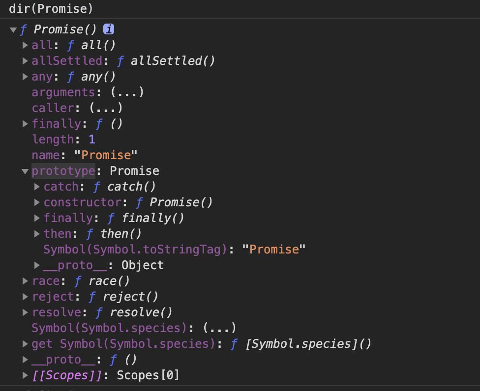

# [js深入理解](https://javascript.info/)
## 基本概念
js模块按照编程语言的一般规律：用一定的**文法**（词法+语法），表达一定**语义**，从而操作**运行时**；

按照程序的一般规律：把**运行时**分为数据结构+算法；数据结构包含**类型**（js的类型系统为7种基本类型和7种语言类型）+实例（内置对象部分）；算法就是js 的**执行过程**。

**执行过程**：从大结构到小结构的角度分析为：从最顶层的程序与模块、事件循环和微任务，到函数、再到语句级的执行。


## 类型
7种语言类型：Undefined、Null、Boolean、String、Number、Symbol、Object

Number、String、Boolean三个类型比较特殊，当和new搭配时，表示新建对象；当直接调用时，表示类型转换。但是，Symbol比较特殊，它只能作为构造器使用，和 new 搭配会报错。

> 几个概念

**装箱**操作:它会根据基础类型生成一个临时对象，使得我们能够在基础类型上调用对应对象的方法。装箱机制会频繁产生临时对象，在一些对性能要求较高的场景下，我们应该尽量避免对基本类型做装箱转换。

**拆箱**操作:和装箱操作对应的是“拆箱”操作，也就是说把对象转变为基本类型，比如Number和String之间的转换，都要先进行拆箱操作，取出基本类型，然后再把基本类型转换为对应地String或者Number。

在JavaScript标准中，规定了 ToPrimitive 内置函数，用于实现拆箱，它有一个参数 hint，用来表示要转换的类型，有三个取值：number、string、default

**类型转换**:比如 == 比较运算，它属于设计失误，在实践中通常被禁止使用，转而使用 ===

> js中的对象

- 对象的特点：
    具有唯一标识性：内存地址
    有状态与行为：抽象为属性，c++(成员变量、成员函数)、java（属性、方法）
    动态性：在运行时可为对象添改状态和行为
- 对象的两种属性
  数据属性:四个特征
  ```
    var a={a:1}
    Object.getOwnPropertyDescriptor(a,"a")//获取
    //{
     value: 1,//属性的值
     writable: true, //决定属性能否被赋值
     enumerable: true, //决定for in能否枚举该属性
     configurable: true//决定该属性能否被删除或者改变特征值
    }

    Object.defineProperty(a,"b",{//设置的b属性的数据属性writable为false
     value: 1,//属性的值
     writable: false, //决定属性能否被赋值
     enumerable: true, //决定for in能否枚举该属性
     configurable: true//决定该属性能否被删除或者改变特征值
    })
    a.b=3//3
    a//{a: 1, b: 1}

  ```
  访问器属性:（四个特征）
    getter:函数or undefined,取属性值时被调用
    setter:函数or undefined,设置属性值时被调用
    enumerable: true, //决定for in能否枚举该属性
    configurable: true//决定该属性能否被删除或者改变特征值
<hr>

## js原生知识点

-   1.函数提升变量提升函数提升优先于变量提升
-   2.当函数名和变量名相同时,如果变量没有被赋值,则函数生效，否则变量生效
-   3.var s= function g(){};g 是只读的 g 只能在函数内部访问
-   4.this 谁调用指向谁没人调用他就指向 window
-   5.this 当函数创建的时候 this 指向当前函数的实例
-   6.简单的函数声明不能被 new
-   7.es6 简写的函数体不能被 new ，否则会报错
-   8.对象与闭包之间必须有分号
-   9.原型链需要先 new，找不到值才会去找自身
-   10.闭包用完后，执行=null，避免内存泄漏（变量释放，执行垃圾回收机制）

## jq 技术内幕

## es5&es6-9

## es5 核心

-   1、立即执行函数
-   2、闭包内部函数可以访问外部函数的变量,把函数返回出去;闭包可以保护内部的变量，闭包造成内存泄漏==null
-   3、原型链、
-   -   3.1 构造函数里的属性的优先级比原型链的要高
-   -   3.2 面向对象编程的时候 Js 没有类的感念可以用函数替代
-   -   3.3 constructor 实际就是对应的那个函数
-   -   3.4 prototype 按引用传递的 Obejct.create 原型链的副本
-   4、数值、字符串、布尔类型按值传递；按引用传递对象~数组~
-   5、改变 this 的方法 call apply，bind 返回新的对象
-   6、函数提升的级别要比变量高

## js 函数式编程

### [函数式编程]()（lodash\Ramda 库）

-   纯函数：纯函数是这样一种函数，即相同的输入，永远会得到相同的输出，而且没有任何可观察的副作- 用。通过延迟执行的方式把不纯的函数转换为纯函数。
-   函数柯里化：只传递给函数一部分参数来调用它，让它返回一个函数去处理剩下的参数
-   [声明式代码示例](./code/flickr/index.html)：声明式的、可组合的方式创建的示例应用
-   Hindley-Milner 类型签名: 推断函数可能的实现，还能够给我们带来自由定理

    ```
    array.reduce(function(total, currentValue, currentIndex, arr), initialValue) initialValue：传递给函数的初始值
    reduce :: (b -> a -> b) -> b -> [a] -> b
    第一个参数为function：f,函数为(b,a)=>b，其中传参数b类等于total，参数a类等于currentValue，返回的b为下一次循环的参数a
    第二个参数为b，b作为参数传入函数f
    第三参数为数组xs，参数a的集合[a]，其中每个a作为参数传入函数f
    最终返回b：第一个参数函数的输出就是 reduce 函数的输出

    ```

# 一些知识盲区

1、[settimeout的第三个参数](https://developer.mozilla.org/zh-CN/docs/Web/API/WindowOrWorkerGlobalScope/setTimeout)
作用：作为第一个func()的参数传进去
有兼容性：IE9 及更早的 IE 浏览器不支持
setTimeout((s) => {
           console.log(s,"s")
        }, 1000,"hh")
//hh s
2、addeventlistener的第三个参数：addEventListener("click",function(){},true);//false：冒泡；true：捕获

3、csp：网页安全政策Content Security Policy[#浏览器同源策略&&常见攻击](../3、js运行时环境/浏览器工作原理与实践.md),作用：由服务端来决定可以加载哪些第三⽅资源

# 一些新知识
- fetch
const response = await fetch(url, {
  method: 'POST',
  headers: {
    "Content-type": "application/x-www-form-urlencoded; charset=UTF-8",
  },
  body: 'foo=bar&lorem=ipsum',
});

const json = await response.json();

# 常见知识
- 防抖
  - 定义：当事件被触发时，设定一个周期**延迟执行**动作，若期间又被触发，则**重新设定**周期，直到周期结束，执行动作；当事件快速连续不断触发时，动作只会执行一次
```
function debounce(fn,delay){
    let time=null
    return ()=>{
        if(time){
            clearInterval(time)
        }
        time = setTimeout(fn,delay)
    }
}
```
- 节流
  - 定义：节流的策略是，固定周期内，只执行一次动作，若有新事件触发，不执行。周期结束后，又有事件触发，开始新的周期。
  ```
    function throttle(fn,delay) {
      let canRun = true; // 通过闭包保存一个标记
      return function () {
          if (!canRun) return; // 在函数开头判断标记是否为true，不为true则return
          canRun = false; // 立即设置为false
          setTimeout(() => { // 将外部传入的函数的执行放在setTimeout中
              fn.apply(this, arguments);
              // 最后在setTimeout执行完毕后再把标记设置为true(关键)表示可以执行下一次循环了。当定时器没有执行的时候标记永远是false，在开头被return掉
              canRun = true;
          }, delay);
      };
  }
  ```

- promise源码


