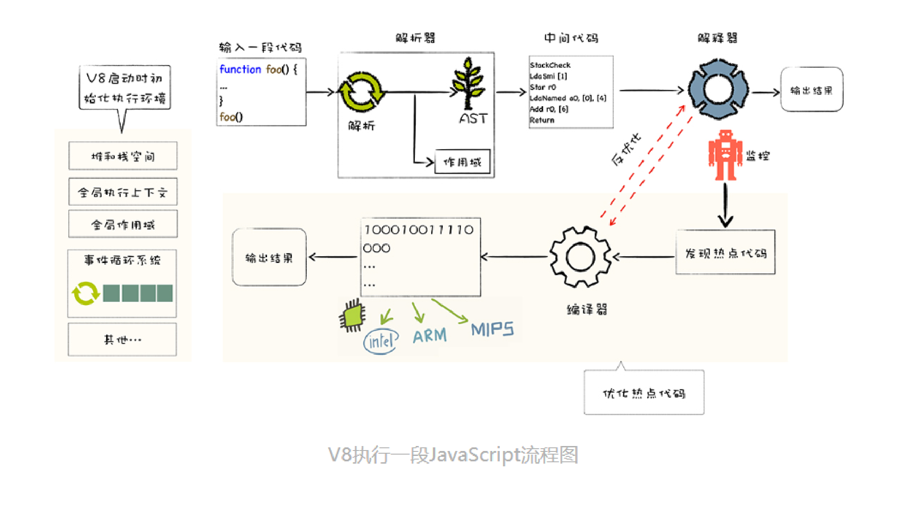
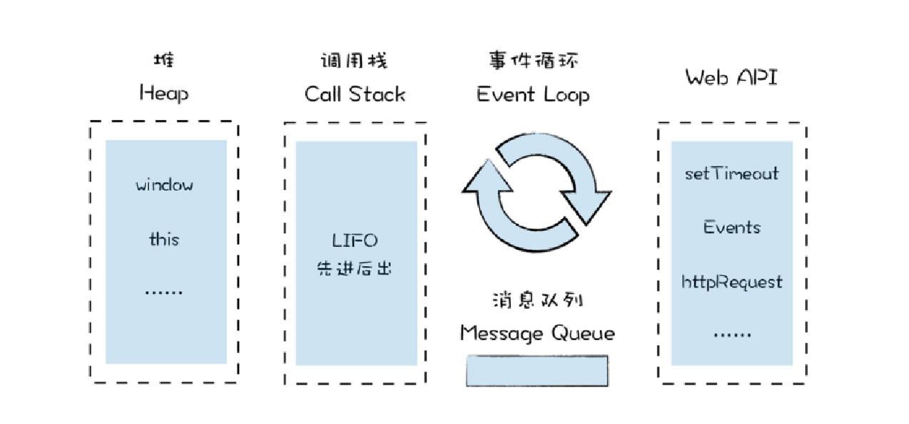
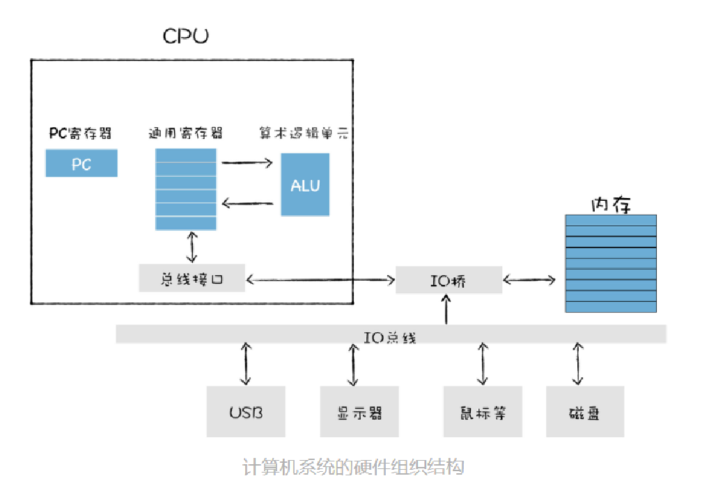
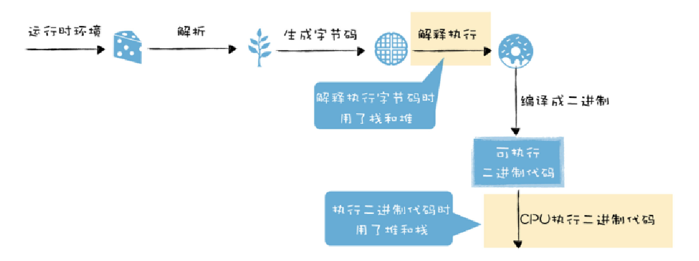
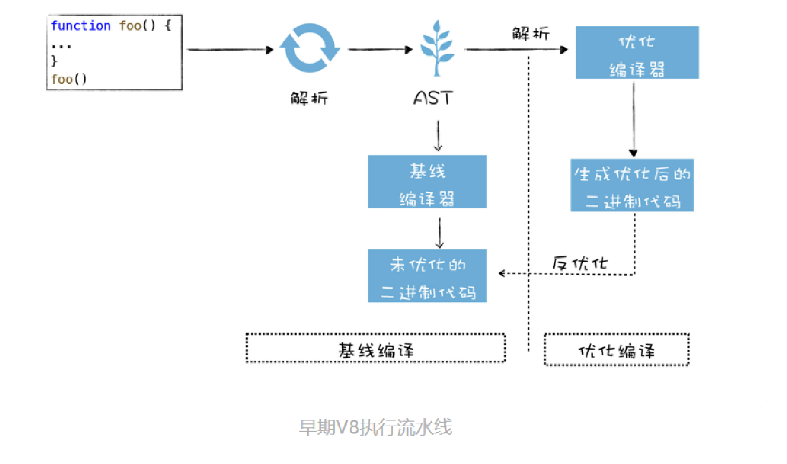
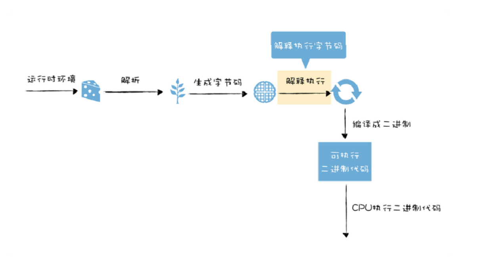

<!-- START doctoc generated TOC please keep comment here to allow auto update -->
<!-- DON'T EDIT THIS SECTION, INSTEAD RE-RUN doctoc TO UPDATE -->
**Table of Contents**  *generated with [DocToc](https://github.com/thlorenz/doctoc)*

- [v8如何执行代码](#v8%E5%A6%82%E4%BD%95%E6%89%A7%E8%A1%8C%E4%BB%A3%E7%A0%81)
- [函数即对象](#%E5%87%BD%E6%95%B0%E5%8D%B3%E5%AF%B9%E8%B1%A1)
- [v8如何提升对象属性的访问速度](#v8%E5%A6%82%E4%BD%95%E6%8F%90%E5%8D%87%E5%AF%B9%E8%B1%A1%E5%B1%9E%E6%80%A7%E7%9A%84%E8%AE%BF%E9%97%AE%E9%80%9F%E5%BA%A6)
- [函数表达式](#%E5%87%BD%E6%95%B0%E8%A1%A8%E8%BE%BE%E5%BC%8F)
- [原型链：v8如何实现对象继承](#%E5%8E%9F%E5%9E%8B%E9%93%BEv8%E5%A6%82%E4%BD%95%E5%AE%9E%E7%8E%B0%E5%AF%B9%E8%B1%A1%E7%BB%A7%E6%89%BF)
- [作用域链：v8如何查找变量](#%E4%BD%9C%E7%94%A8%E5%9F%9F%E9%93%BEv8%E5%A6%82%E4%BD%95%E6%9F%A5%E6%89%BE%E5%8F%98%E9%87%8F)
- [类型转换：v8如何实现1+‘2’](#%E7%B1%BB%E5%9E%8B%E8%BD%AC%E6%8D%A2v8%E5%A6%82%E4%BD%95%E5%AE%9E%E7%8E%B012)
- [运行时环境：运行js代码的基石](#%E8%BF%90%E8%A1%8C%E6%97%B6%E7%8E%AF%E5%A2%83%E8%BF%90%E8%A1%8Cjs%E4%BB%A3%E7%A0%81%E7%9A%84%E5%9F%BA%E7%9F%B3)
- [机器代码：二进制代码如何被cpu执行](#%E6%9C%BA%E5%99%A8%E4%BB%A3%E7%A0%81%E4%BA%8C%E8%BF%9B%E5%88%B6%E4%BB%A3%E7%A0%81%E5%A6%82%E4%BD%95%E8%A2%ABcpu%E6%89%A7%E8%A1%8C)
- [堆和栈：函数调用是如何影响到内存布局的](#%E5%A0%86%E5%92%8C%E6%A0%88%E5%87%BD%E6%95%B0%E8%B0%83%E7%94%A8%E6%98%AF%E5%A6%82%E4%BD%95%E5%BD%B1%E5%93%8D%E5%88%B0%E5%86%85%E5%AD%98%E5%B8%83%E5%B1%80%E7%9A%84)
- [延迟执行：v8是如何实现闭包的](#%E5%BB%B6%E8%BF%9F%E6%89%A7%E8%A1%8Cv8%E6%98%AF%E5%A6%82%E4%BD%95%E5%AE%9E%E7%8E%B0%E9%97%AD%E5%8C%85%E7%9A%84)
- [字节码：v8为什么又重新引入字节码](#%E5%AD%97%E8%8A%82%E7%A0%81v8%E4%B8%BA%E4%BB%80%E4%B9%88%E5%8F%88%E9%87%8D%E6%96%B0%E5%BC%95%E5%85%A5%E5%AD%97%E8%8A%82%E7%A0%81)
- [字节码：解释器是如何解析执行字节码的](#%E5%AD%97%E8%8A%82%E7%A0%81%E8%A7%A3%E9%87%8A%E5%99%A8%E6%98%AF%E5%A6%82%E4%BD%95%E8%A7%A3%E6%9E%90%E6%89%A7%E8%A1%8C%E5%AD%97%E8%8A%82%E7%A0%81%E7%9A%84)
- [隐藏类：如何在内存中快速查找对象属性](#%E9%9A%90%E8%97%8F%E7%B1%BB%E5%A6%82%E4%BD%95%E5%9C%A8%E5%86%85%E5%AD%98%E4%B8%AD%E5%BF%AB%E9%80%9F%E6%9F%A5%E6%89%BE%E5%AF%B9%E8%B1%A1%E5%B1%9E%E6%80%A7)
- [消息队列：v8是如何实现函数回调的](#%E6%B6%88%E6%81%AF%E9%98%9F%E5%88%97v8%E6%98%AF%E5%A6%82%E4%BD%95%E5%AE%9E%E7%8E%B0%E5%87%BD%E6%95%B0%E5%9B%9E%E8%B0%83%E7%9A%84)
- [异步编程：v8是如何实现微任务的](#%E5%BC%82%E6%AD%A5%E7%BC%96%E7%A8%8Bv8%E6%98%AF%E5%A6%82%E4%BD%95%E5%AE%9E%E7%8E%B0%E5%BE%AE%E4%BB%BB%E5%8A%A1%E7%9A%84)
- [异步编程：v8是如何实现async、await的](#%E5%BC%82%E6%AD%A5%E7%BC%96%E7%A8%8Bv8%E6%98%AF%E5%A6%82%E4%BD%95%E5%AE%9E%E7%8E%B0asyncawait%E7%9A%84)
- [垃圾回收：v8的两个垃圾回收器是如何工作的](#%E5%9E%83%E5%9C%BE%E5%9B%9E%E6%94%B6v8%E7%9A%84%E4%B8%A4%E4%B8%AA%E5%9E%83%E5%9C%BE%E5%9B%9E%E6%94%B6%E5%99%A8%E6%98%AF%E5%A6%82%E4%BD%95%E5%B7%A5%E4%BD%9C%E7%9A%84)
- [垃圾回收：v8是如何优化垃圾回收器执行效率的](#%E5%9E%83%E5%9C%BE%E5%9B%9E%E6%94%B6v8%E6%98%AF%E5%A6%82%E4%BD%95%E4%BC%98%E5%8C%96%E5%9E%83%E5%9C%BE%E5%9B%9E%E6%94%B6%E5%99%A8%E6%89%A7%E8%A1%8C%E6%95%88%E7%8E%87%E7%9A%84)
- [v8是如何通过内联缓存来提升函数执行效率的](#v8%E6%98%AF%E5%A6%82%E4%BD%95%E9%80%9A%E8%BF%87%E5%86%85%E8%81%94%E7%BC%93%E5%AD%98%E6%9D%A5%E6%8F%90%E5%8D%87%E5%87%BD%E6%95%B0%E6%89%A7%E8%A1%8C%E6%95%88%E7%8E%87%E7%9A%84)
- [几种常见内存问题的解决策略](#%E5%87%A0%E7%A7%8D%E5%B8%B8%E8%A7%81%E5%86%85%E5%AD%98%E9%97%AE%E9%A2%98%E7%9A%84%E8%A7%A3%E5%86%B3%E7%AD%96%E7%95%A5)
- [如何构建和使用v8的调试工具d8](#%E5%A6%82%E4%BD%95%E6%9E%84%E5%BB%BA%E5%92%8C%E4%BD%BF%E7%94%A8v8%E7%9A%84%E8%B0%83%E8%AF%95%E5%B7%A5%E5%85%B7d8)

<!-- END doctoc generated TOC please keep comment here to allow auto update -->


> google [v8](https://v8.dev/docs)：由google开发的开源js引擎

# v8如何执行代码
计算机执行高级语言的两种基本方式：解释执行、编译执行；区别**编译执行**最终会由编译器（虚拟机）生成机器代码（二进制），机器代码执行输出结果；**解释执行**则是由解释器直接输出结果。



惰性解析：减少代码解析编译时间，内存有限（解析后字节码、编译后机器码存放在内存）；**解析器**在解析的过程中，遇到函数申明，会跳过函数内部代码，并不会为其生成AST和字节码，而仅仅生成顶层代码的AST和字节码（函数调用为栈结构先进后出）。

# 函数即对象

**函数是一等公民**：一等公民可以作为函数参数，可以作为函数返回值，也可以赋值给变量

作用域提升

隐藏对象：name、code

# v8如何提升对象属性的访问速度
对象属性：常规属性（字符串，properties根据创建时的顺序升序排列）、排序属性（elements按照索引值大小升序排列，线性存储，查找快）
对象内属性（默认为10）：常规属性直接存储到对象本身（线性存储）；当内属性超出10个，常规属性直接保存属性字典中（非线性的字典map，修改快）

⚠️注意：属性过多、反复添加或者删除属性的操作，v8就会将线性存储模式降级为非线性的字典模式，降低了查找速度，提高修改速度。

```
function foo(properties_num,elements_num){
    //添加可索引属性
    for(let x=0;x<elements_num;x++){
        this[x]=`elements${x}`
    }
    //添加常规属性
    for(let i=0;i<properties_num;i++){
        let ppt=`properties${i}`
        this[ppt]=ppt
    }
}
var bar=foo(20,20)
```
# 函数表达式
代码隐藏、变量隔离

函数申明vs函数表达式

```
//函数申明
    foo()
    function foo(){
        console.log("foo")
    }
    //编译阶段
    function foo(){
        console.log("foo")
    }//函数作用域提升
    foo()


```
```
//函数表达式
    foo()
    var foo=function(){
        console.log("foo")
    }
    //编译阶段
    var foo=undefined//变量提升，被赋值为undefined
    foo=function(){
        console.log("foo")
    }
```
```
//代码
    var n=1;
    (function(){
            n=100;
            console.log("foo")
    })()
    console.log(n)
    //分析
    var n=undefined
    n=1
    (function(){
            n=100;
            console.log("foo")
    })()
    console.log(n)
    //结果
    foo ,100
```
```
//代码
    var n=1;
    function foo(){
            n=100;
            console.log("foo")
    }
    console.log(n)
    foo()
    //分析
    var n=undefined
    function(){
            n=100;
            console.log("foo")
    })
    n=1
    console.log(n)
    foo()
    //结果
    1，foo
```
()中放置表达式，(fun)()立即调用函数表达式（IIFE）：好处不会污染环境，函数和函数内部的变量都不会被其他部分的代码访问到
# 原型链：v8如何实现对象继承

继承：一个对象可可以访问另一个对象中的属性和方法，在js中，我们通过原型和原型链的方法来实现继承特性

编程语言实现继承的常用方法：基于类的设计和基于原型继承的设计。

对象的原型：对象上隐藏的属性__proto__。

原型对象：把对象A的__proto__指向内存中的对象B，称B对象为A对象的原型对象，A对象可已直接访问B对象的方法或者属性。

原型链：查找属性的路径，沿着对象的原型一级一级来查找属性；

作用域链：沿着函数的作用域一级一级来查找变量；

```
//利用__proto__实现继承,构造函数
function DogFactory(type,color){
    this.type=type
    this.color=color
}
var dog=new DogFactory("Dog",""black")
// 分析
var dog={}
dog.__protp__=DogFactory.prototype//DogFactory的prototype指向原型对象
DogFactory.call(dog,"Dog","black")//把this指向dog
```

# 作用域链：v8如何查找变量
```
var name="name1"
var type="global"
function foo(){
    var name="foo"
    console.log(name)
    console.log(type)
}
function bar(){
    var name="bar"
    var type ="function"
    foo()
}
bar()//foo、global
```

```
var name="name1"
var type="global"
function bar(){
    var name="bar"
    var type ="function"
    function foo(){
    console.log(type)
    }
    foo()
}
bar()//function
```

查找顺序：当前函数作用域无，去全局作用域查找，这个查找的路线为作用域链；js采用的作用域机制是**词法作用域**
vs：**全局作用域**在v8启动过程中就创建，且一直保存在内存不会被销毁，直至v8退出。**函数作用域**是在执行该函数时创建的，当函数执行结束后，函数作用域就随之被销毁掉。

词法作用域：采用词法作用域的变量叫词法变量，词法变量有一个在编译时静态确定的作用域，查找作用域的顺序是按照函数**定义时**的位置来决定的。作用域是在声明函数时就确定的，故也称词法作用域为静态作用域。

动态作用域：动态作用域的变量叫做动态变量，动态作用域里，取变量的值时，会由内向外逐层检查函数的调用链，并打印第一次遇到的那个绑定的值。
# 类型转换：v8如何实现1+‘2’
机器语言，所有数据都是一堆二进制代码，按照二进制操作数据，移位、相加、相乘；类型是高级语言中的概念。

类型系统：每种语言都定义了自己的类型，还定义了如何操作这些类型，以及这些类型应该如何相互作用。

js操作类型的策略：

# 运行时环境：运行js代码的基石

堆空间：用树形的存储结构，来存储对象类型的离散的数据。

栈空间：用来管理javascript函数调用，栈是内存中连续的一块空间（空间连续），同时栈结构是先进后出的策略。在函数调用过程中，涉及到**上下文Context**相关的内容都会放在栈上.

执行上下文：包含变量环境、词法环境和this关键字。

作用域：全局作用域&函数（内部）作用域

**全局**执行上下文：生命周期与v8生命周期一致。**全局**执行上下文与**函数**执行上线文的生命周期不同，**函数**执行上线文在函数执行结束后就会被销毁

宿主环境启动过程中提供：构造数据存储空间（堆空间和栈空间）=>**全局**执行上下文和全局作用域=>构建事件循环系统（处理任务的排队和调度）

v8自身提供：javascript的核心功能与垃圾回收系统♻️

# 机器代码：二进制代码如何被cpu执行

cpu时钟周期：取出指令、分析指令、执行指令三个过程。

cpu：只能执行机器代码。

pc寄存器：存在于cup，用来存储指向下一个时钟周期的指令地址

通用寄存器：cup中用来存放数据的设备，不同处理器中的寄存器个数不一；作用是加快cup执行速度。通用寄存器容量小，读写速度快，内存容量大，读写速度慢。

使用寄存器的方法：加载指令、存储指令、更新指令

运算器：算术逻辑单元ALU

编译器：高级语言代码编译成二进制代码。

汇编：将汇编语言编写的程序转换为机器语言的过程。

反汇编：机器语言转化为汇编语言的过程。

# 堆和栈：函数调用是如何影响到内存布局的


函数调用是先进后出，栈结构也是先进后出，用栈来管理函数调用；把管理函数调用过程的栈结构称为**调用栈**。


# 延迟执行：v8是如何实现闭包的
js中闭包的三个基础特性：
    js语言允许在函数内部定义新的函数
    内部函数中访问父函数中定义的变量
    函数是一等公民。函数可以作为返回值

**预解析器**：1、判断基本语法错误；2、检查函数内部是否引用外部变量，如有则将栈中的变量复制到堆中（解决闭包的问题）

# 字节码：v8为什么又重新引入字节码


早期chrome，并未引入字节码，有两个问题：1、时间问题，编译时间过久；2、空间问题：缓存编译后的二进制代码占用更多的内存。
二进制**代码缓存**：把二进制代码保存在内存中来消除冗余的编译，重用它们完成后续的调用，省去再次编译的时间。两种缓存策略：1、内存缓存（in-memory cache）；2、代码缓存在硬盘

字节码优势：
解决启动问题：生成字节码的时间短；**解释器lgnition**可以直接解析执行字节码；**优化编译器TurboFan**可以将字节码编译成为二进制代码，然后再执行机器码；
解决空间问题：字节码，占用内存不多，缓存字节码会大大降低内存的使用；
代码架构清晰：采用字节码，可以简化程序的复杂度，使得v8移植到不同cpu架构的平台更加容易

机器码与字节码的异同：都是二进制代码，但是由于执行环境不一样，所以存在指令集上的区别；机器码：计算机可直接执行，并且执行速度最快的代码；字节码：由编译器将源码编译成字节码，在虚拟机上执行。

# 字节码：解释器是如何解析执行字节码的



# 隐藏类：如何在内存中快速查找对象属性

# 消息队列：v8是如何实现函数回调的

# 异步编程：v8是如何实现微任务的

# 异步编程：v8是如何实现async、await的

# 垃圾回收：v8的两个垃圾回收器是如何工作的

# 垃圾回收：v8是如何优化垃圾回收器执行效率的

# v8是如何通过内联缓存来提升函数执行效率的

# 几种常见内存问题的解决策略

# 如何构建和使用v8的调试工具d8
编译好的d8工具：
[mac平台](https://storage.googleapis.com/chromium-v8/official/canary/v8-mac64-dbg-8.4.109.zip)
[linux32平台](https://storage.googleapis.com/chromium-v8/official/canary/v8-linux32-dbg-8.4.109.zip)
[linux64平台](https://storage.googleapis.com/chromium-v8/official/canary/v8-linux64-dbg-8.4.109.zip)
[win32平台](https://storage.googleapis.com/chromium-v8/official/canary/v8-win32-dbg-8.4.109.zip)
[win64平台](https://storage.googleapis.com/chromium-v8/official/canary/v8-win64-dbg-8.4.109.zip)

执行命令需切换到d8目录，不然会报Failed to open startup resource 'snapshot_blob.bin'.

<hr>
JIT、作用域、词法环境、执行上下文

- 快速入门技术栈：
    知识的宏观架构
    过往历史
    优缺点
    结合个人整理技术栈

- js虚拟机：
    safari -javascriptcore
    firefox：tracemonkey
    chrome/node/dono：v8

- 技术栈：
    浏览器架构
    web网络
    事件循环机制
    js核心
    v8的内存管理
    浏览器的渲染流程
    web安全
    css
    react
    vue
    node
    构建工具链
