<!-- START doctoc generated TOC please keep comment here to allow auto update -->
<!-- DON'T EDIT THIS SECTION, INSTEAD RE-RUN doctoc TO UPDATE -->
**Table of Contents**  *generated with [DocToc](https://github.com/thlorenz/doctoc)*

- [v8如何执行代码](#v8%E5%A6%82%E4%BD%95%E6%89%A7%E8%A1%8C%E4%BB%A3%E7%A0%81)
- [函数即对象](#%E5%87%BD%E6%95%B0%E5%8D%B3%E5%AF%B9%E8%B1%A1)
- [v8如何提升对象属性的访问速度](#v8%E5%A6%82%E4%BD%95%E6%8F%90%E5%8D%87%E5%AF%B9%E8%B1%A1%E5%B1%9E%E6%80%A7%E7%9A%84%E8%AE%BF%E9%97%AE%E9%80%9F%E5%BA%A6)
- [函数表达式](#%E5%87%BD%E6%95%B0%E8%A1%A8%E8%BE%BE%E5%BC%8F)
- [原型链：v8如何实现对象继承](#%E5%8E%9F%E5%9E%8B%E9%93%BEv8%E5%A6%82%E4%BD%95%E5%AE%9E%E7%8E%B0%E5%AF%B9%E8%B1%A1%E7%BB%A7%E6%89%BF)
- [作用域链：v8如何查找变量](#%E4%BD%9C%E7%94%A8%E5%9F%9F%E9%93%BEv8%E5%A6%82%E4%BD%95%E6%9F%A5%E6%89%BE%E5%8F%98%E9%87%8F)
- [类型转换：v8如何实现1+‘2’](#%E7%B1%BB%E5%9E%8B%E8%BD%AC%E6%8D%A2v8%E5%A6%82%E4%BD%95%E5%AE%9E%E7%8E%B012)
- [运行时环境：运行js代码的基石](#%E8%BF%90%E8%A1%8C%E6%97%B6%E7%8E%AF%E5%A2%83%E8%BF%90%E8%A1%8Cjs%E4%BB%A3%E7%A0%81%E7%9A%84%E5%9F%BA%E7%9F%B3)
- [机器代码：二进制代码如何被cpu执行](#%E6%9C%BA%E5%99%A8%E4%BB%A3%E7%A0%81%E4%BA%8C%E8%BF%9B%E5%88%B6%E4%BB%A3%E7%A0%81%E5%A6%82%E4%BD%95%E8%A2%ABcpu%E6%89%A7%E8%A1%8C)
- [堆和栈：函数调用是如何影响到内存布局的](#%E5%A0%86%E5%92%8C%E6%A0%88%E5%87%BD%E6%95%B0%E8%B0%83%E7%94%A8%E6%98%AF%E5%A6%82%E4%BD%95%E5%BD%B1%E5%93%8D%E5%88%B0%E5%86%85%E5%AD%98%E5%B8%83%E5%B1%80%E7%9A%84)
- [延迟执行：v8是如何实现闭包的](#%E5%BB%B6%E8%BF%9F%E6%89%A7%E8%A1%8Cv8%E6%98%AF%E5%A6%82%E4%BD%95%E5%AE%9E%E7%8E%B0%E9%97%AD%E5%8C%85%E7%9A%84)
- [字节码：v8为什么又重新引入字节码](#%E5%AD%97%E8%8A%82%E7%A0%81v8%E4%B8%BA%E4%BB%80%E4%B9%88%E5%8F%88%E9%87%8D%E6%96%B0%E5%BC%95%E5%85%A5%E5%AD%97%E8%8A%82%E7%A0%81)
- [字节码：解释器是如何解析执行字节码的](#%E5%AD%97%E8%8A%82%E7%A0%81%E8%A7%A3%E9%87%8A%E5%99%A8%E6%98%AF%E5%A6%82%E4%BD%95%E8%A7%A3%E6%9E%90%E6%89%A7%E8%A1%8C%E5%AD%97%E8%8A%82%E7%A0%81%E7%9A%84)
- [隐藏类：如何在内存中快速查找对象属性](#%E9%9A%90%E8%97%8F%E7%B1%BB%E5%A6%82%E4%BD%95%E5%9C%A8%E5%86%85%E5%AD%98%E4%B8%AD%E5%BF%AB%E9%80%9F%E6%9F%A5%E6%89%BE%E5%AF%B9%E8%B1%A1%E5%B1%9E%E6%80%A7)
- [消息队列：v8是如何实现函数回调的](#%E6%B6%88%E6%81%AF%E9%98%9F%E5%88%97v8%E6%98%AF%E5%A6%82%E4%BD%95%E5%AE%9E%E7%8E%B0%E5%87%BD%E6%95%B0%E5%9B%9E%E8%B0%83%E7%9A%84)
- [异步编程：v8是如何实现微任务的](#%E5%BC%82%E6%AD%A5%E7%BC%96%E7%A8%8Bv8%E6%98%AF%E5%A6%82%E4%BD%95%E5%AE%9E%E7%8E%B0%E5%BE%AE%E4%BB%BB%E5%8A%A1%E7%9A%84)
- [异步编程：v8是如何实现async、await的](#%E5%BC%82%E6%AD%A5%E7%BC%96%E7%A8%8Bv8%E6%98%AF%E5%A6%82%E4%BD%95%E5%AE%9E%E7%8E%B0asyncawait%E7%9A%84)
- [垃圾回收：v8的两个垃圾回收器是如何工作的](#%E5%9E%83%E5%9C%BE%E5%9B%9E%E6%94%B6v8%E7%9A%84%E4%B8%A4%E4%B8%AA%E5%9E%83%E5%9C%BE%E5%9B%9E%E6%94%B6%E5%99%A8%E6%98%AF%E5%A6%82%E4%BD%95%E5%B7%A5%E4%BD%9C%E7%9A%84)
- [垃圾回收：v8是如何优化垃圾回收器执行效率的](#%E5%9E%83%E5%9C%BE%E5%9B%9E%E6%94%B6v8%E6%98%AF%E5%A6%82%E4%BD%95%E4%BC%98%E5%8C%96%E5%9E%83%E5%9C%BE%E5%9B%9E%E6%94%B6%E5%99%A8%E6%89%A7%E8%A1%8C%E6%95%88%E7%8E%87%E7%9A%84)
- [v8是如何通过内联缓存来提升函数执行效率的](#v8%E6%98%AF%E5%A6%82%E4%BD%95%E9%80%9A%E8%BF%87%E5%86%85%E8%81%94%E7%BC%93%E5%AD%98%E6%9D%A5%E6%8F%90%E5%8D%87%E5%87%BD%E6%95%B0%E6%89%A7%E8%A1%8C%E6%95%88%E7%8E%87%E7%9A%84)
- [几种常见内存问题的解决策略](#%E5%87%A0%E7%A7%8D%E5%B8%B8%E8%A7%81%E5%86%85%E5%AD%98%E9%97%AE%E9%A2%98%E7%9A%84%E8%A7%A3%E5%86%B3%E7%AD%96%E7%95%A5)
- [如何构建和使用v8的调试工具d8](#%E5%A6%82%E4%BD%95%E6%9E%84%E5%BB%BA%E5%92%8C%E4%BD%BF%E7%94%A8v8%E7%9A%84%E8%B0%83%E8%AF%95%E5%B7%A5%E5%85%B7d8)

<!-- END doctoc generated TOC please keep comment here to allow auto update -->


> google [v8](https://v8.dev/docs)：由google开发的开源js引擎

# v8如何执行代码
计算机执行高级语言的两种基本方式：解释执行、编译执行；区别**编译执行**最终会由编译器（虚拟机）生成机器代码（二进制），机器代码执行输出结果；**解释执行**则是由解释器直接输出结果。


惰性解析：减少代码解析编译时间，内存有限（解析后字节码、编译后机器码存放在内存）；**解析器**在解析的过程中，遇到函数申明，会跳过函数内部代码，并不会为其生成AST和字节码，而仅仅生成顶层代码的AST和字节码（函数调用为栈结构先进后出）。

# 函数即对象

**函数是一等公民**：一等公民可以作为函数参数，可以作为函数返回值，也可以赋值给变量

作用域提升

隐藏对象：name、code

# v8如何提升对象属性的访问速度
对象属性：常规属性（字符串，properties根据创建时的顺序升序排列）、排序属性（elements按照索引值大小升序排列，线性存储，查找快）
对象内属性（默认为10）：常规属性直接存储到对象本身（线性存储）；当内属性超出10个，常规属性直接保存属性字典中（非线性的字典map，修改快）

⚠️注意：属性过多、反复添加或者删除属性的操作，v8就会将线性存储模式降级为非线性的字典模式，降低了查找速度，提高修改速度。

```
function foo(properties_num,elements_num){
    //添加可索引属性
    for(let x=0;x<elements_num;x++){
        this[x]=`elements${x}`
    }
    //添加常规属性
    for(let i=0;i<properties_num;i++){
        let ppt=`properties${i}`
        this[ppt]=ppt
    }
}
var bar=foo(20,20)
```
# 函数表达式
代码隐藏、变量隔离

函数申明vs函数表达式

```
//函数申明
    foo()
    function foo(){
        console.log("foo")
    }
    //编译阶段
    function foo(){
        console.log("foo")
    }//函数作用域提升
    foo()


```
```
//函数表达式
    foo()
    var foo=function(){
        console.log("foo")
    }
    //编译阶段
    var foo=undefined//变量提升，被赋值为undefined
    foo=function(){
        console.log("foo")
    }
```
```
//代码
    var n=1;
    (function(){
            n=100;
            console.log("foo")
    })()
    console.log(n)
    //分析
    var n=undefined
    n=1
    (function(){
            n=100;
            console.log("foo")
    })()
    console.log(n)
    //结果
    foo ,100
```
```
//代码
    var n=1;
    function foo(){
            n=100;
            console.log("foo")
    }
    console.log(n)
    foo()
    //分析
    var n=undefined
    function(){
            n=100;
            console.log("foo")
    })
    n=1
    console.log(n)
    foo()
    //结果
    1，foo
```
()中放置表达式，(fun)()立即调用函数表达式（IIFE）：好处不会污染环境，函数和函数内部的变量都不会被其他部分的代码访问到
# 原型链：v8如何实现对象继承

继承：一个对象可可以访问另一个对象中的属性和方法，在js中，我们通过原型和原型链的方法来实现继承特性

编程语言实现继承的常用方法：基于类的设计和基于原型继承的设计。

对象的原型：对象上隐藏的属性__proto__。

原型对象：把对象A的__proto__指向内存中的对象B，称B对象为A对象的原型对象，A对象可已直接访问B对象的方法或者属性。

原型链：查找属性的路径，沿着对象的原型一级一级来查找属性；

作用域链：沿着函数的作用域一级一级来查找变量；

```
//利用__proto__实现继承,构造函数
function DogFactory(type,color){
    this.type=type
    this.color=color
}
var dog=new DogFactory("Dog",""black")
// 分析
var dog={}
dog.__protp__=DogFactory.prototype//DogFactory的prototype指向原型对象
DogFactory.call(dog,"Dog","black")//把this指向dog
```

# 作用域链：v8如何查找变量
```
var name="name1"
var type="global"
function foo(){
    var name="foo"
    console.log(name)
    console.log(type)
}
function bar(){
    var name="bar"
    var type ="function"
    foo()
}
bar()//foo、global
```

```
var name="name1"
var type="global"
function bar(){
    var name="bar"
    var type ="function"
    function foo(){
    console.log(type)
    }
    foo()
}
bar()//function
```

查找顺序：当前函数作用域无，去全局作用域查找，这个查找的路线为作用域链；js采用的作用域机制是**词法作用域**
vs：**全局作用域**在v8启动过程中就创建，且一直保存在内存不会被销毁，直至v8退出。**函数作用域**是在执行该函数时创建的，当函数执行结束后，函数作用域就随之被销毁掉。

词法作用域：采用词法作用域的变量叫词法变量，词法变量有一个在编译时静态确定的作用域，查找作用域的顺序是按照函数**定义时**的位置来决定的。作用域是在声明函数时就确定的，故也称词法作用域为静态作用域。

动态作用域：动态作用域的变量叫做动态变量，动态作用域里，取变量的值时，会由内向外逐层检查函数的调用链，并打印第一次遇到的那个绑定的值。
# 类型转换：v8如何实现1+‘2’
机器语言，所有数据都是一堆二进制代码，按照二进制操作数据，移位、相加、相乘；类型是高级语言中的概念。

类型系统：每种语言都定义了自己的类型，还定义了如何操作这些类型，以及这些类型应该如何相互作用。

js操作类型的策略：

# 运行时环境：运行js代码的基石

堆空间：用树形的存储结构，来存储对象类型的离散的数据。

栈空间：用来管理javascript函数调用，栈是内存中连续的一块空间（空间连续），同时栈结构是先进后出的策略。在函数调用过程中，涉及到**上下文Context**相关的内容都会放在栈上.

执行上下文：包含变量环境、词法环境和this关键字。

作用域：全局作用域&函数（内部）作用域

**全局**执行上下文：生命周期与v8生命周期一致。**全局**执行上下文与**函数**执行上线文的生命周期不同，**函数**执行上线文在函数执行结束后就会被销毁

宿主环境启动过程中提供：构造数据存储空间（堆空间和栈空间）=>**全局**执行上下文和全局作用域=>构建事件循环系统（处理任务的排队和调度）

v8自身提供：javascript的核心功能与垃圾回收系统♻️

# 机器代码：二进制代码如何被cpu执行

cpu时钟周期：取出指令、分析指令、执行指令三个过程。

cpu：只能执行机器代码。

- 寄存器：
    pc寄存器：存在于cup，用来存储指向下一个时钟周期的指令地址；
    栈顶指针：指向当前栈顶的位置；
    累加器：保存中间结果；
    通用寄存器：cup中用来存放数据的设备，不同处理器中的寄存器个数不一；作用是加快cup执行速度。通用寄存器容量小，读写速度快，内存容量大，读写速度慢。

使用寄存器的方法：加载指令、存储指令、更新指令

运算器：算术逻辑单元ALU

编译器：高级语言代码编译成二进制代码。

汇编：将汇编语言编写的程序转换为机器语言的过程。

反汇编：机器语言转化为汇编语言的过程。

# 堆和栈：函数调用是如何影响到内存布局的


函数调用是先进后出，栈结构也是先进后出，用栈来管理函数调用；把管理函数调用过程的栈结构称为**调用栈**。


# 延迟执行：v8是如何实现闭包的
js中闭包的三个基础特性：
    js语言允许在函数内部定义新的函数
    内部函数中访问父函数中定义的变量
    函数是一等公民。函数可以作为返回值

**预解析器**：1、判断基本语法错误；2、检查函数内部是否引用外部变量，如有则将栈中的变量复制到堆中（解决闭包的问题）

# 字节码：v8为什么又重新引入字节码


早期chrome，并未引入字节码，有两个问题：1、时间问题，编译时间过久；2、空间问题：缓存编译后的二进制代码占用更多的内存。
二进制**代码缓存**：把二进制代码保存在内存中来消除冗余的编译，重用它们完成后续的调用，省去再次编译的时间。两种缓存策略：1、内存缓存（in-memory cache）；2、代码缓存在硬盘

字节码优势：
解决启动问题：生成字节码的时间短；**解释器lgnition**可以直接解析执行字节码；**优化编译器TurboFan**可以将字节码编译成为二进制代码，然后再执行机器码；
解决空间问题：字节码，占用内存不多，缓存字节码会大大降低内存的使用；
代码架构清晰：采用字节码，可以简化程序的复杂度，使得v8移植到不同cpu架构的平台更加容易

机器码与字节码的异同：都是二进制代码，但是由于执行环境不一样，所以存在指令集上的区别；机器码：计算机可直接执行，并且执行速度最快的代码；字节码：由编译器将源码编译成字节码，在虚拟机上执行。

# 字节码：解释器是如何解析执行字节码的


**解释器**是模拟物理机器来执行字节码的，故解释器的执行架构类似cpu处理机器码架构。
两种类型的解释器：基于栈和基于寄存器。

|   | 基于栈 | 基于寄存器|
|  ---  | ---  | --- |
| 描述  | 使用栈来保存函数参数、中间运算结果、变量等 |支持寄存器的指令操作，使用寄存器来保存参数、中间计算结果 |
| 优缺点  | - |- |
| 常见的虚拟机  | java虚拟机、.net虚拟机、早期v8 |v8 |

>基于寄存器的解释器


> 字节码解读

~/print.js
```
const a=1
const b=2
console.log(a+b)

```
d8 --print-bytecode ~/print.js  
```
[generated bytecode for function:  (0x18f00824fdfd <SharedFunctionInfo>)]
Parameter count 1 #1个参数，隐式地传入的 this
Register count 4
Frame size 32
         0x18f00824fe5e @    0 : 0c 01             LdaSmi [1] #将小整数（Smi）1加载到累加器寄
         0x18f00824fe60 @    2 : 1d 02             StaCurrentContextSlot [2]
         0x18f00824fe62 @    4 : 0c 02             LdaSmi [2] #将小整数（Smi）2加载到累加器寄
         0x18f00824fe64 @    6 : 1d 03             StaCurrentContextSlot [3]
         0x18f00824fe66 @    8 : 13 00 00          LdaGlobal [0], [0]
         0x18f00824fe69 @   11 : 26 f9             Star r2
         0x18f00824fe6b @   13 : 28 f9 01 02       LdaNamedProperty r2, [1], [2]
         0x18f00824fe6f @   17 : 26 fa             Star r1
         0x18f00824fe71 @   19 : 1b 02             LdaImmutableCurrentContextSlot [2]
         0x18f00824fe73 @   21 : 26 f8             Star r3
         0x18f00824fe75 @   23 : 1b 03             LdaImmutableCurrentContextSlot [3]
         0x18f00824fe77 @   25 : 34 f8 04          Add r3, [4] #从r3寄存器加载值并将其与累加器中的值相加，并将结果再次放入累加器中
         0x18f00824fe7a @   28 : 26 f8             Star r3 #Store Accumulator to Register，把累加器中的值保存到r3寄存器中
         0x18f00824fe7c @   30 : 59 fa f9 f8 05    CallProperty1 r1, r2, r3, [5]
         0x18f00824fe81 @   35 : 26 fb             Star r0
         0x18f00824fe83 @   37 : aa                Return #结束当前函数的执行，并将控制权传回给调用方
Constant pool (size = 2)
0x18f00824fe2d: [FixedArray] in OldSpace
 - map: 0x18f0080404b1 <Map>
 - length: 2
           0: 0x18f0081c696d <String[#7]: console>
           1: 0x18f0081c69e1 <String[#3]: log>
Handler Table (size = 0)
Source Position Table (size = 0)
3

```
> 常用指令

Ldar：表示将寄存器中的值加载到累加器中，你可以把它理解为 LoaD Accumulator from Register，就是把某个寄存器中的值，加载到累加器中。

Star：表示 Store Accumulator Register， 你可以把它理解为 Store Accumulator to Register，就是把累加器中的值保存到某个寄存器中。

Add：Add a0, [0]是从 a0 寄存器加载值并将其与累加器中的值相加，然后将结果再次放入累加器。

add a0 后面的[0]称之为 feedback vector slot，又叫反馈向量槽，它是一个数组，解释器将解释执行过程中的一些数据类型的分析信息都保存在这个反馈向量槽中了，目的是为了给 TurboFan 优化编译器提供优化信息，很多字节码都会为反馈向量槽提供运行时信息。

LdaSmi：将小整数（Smi）加载到累加器寄存器中

Return：结束当前函数的执行，并将控制权传回给调用方。返回的值是累加器中的值。
# 隐藏类：如何在内存中快速查找对象属性

|   |隐藏类 |
|---| ---  |
|背景| 基于js是一门**动态类型**语言，对象属性在执行过程中可以被修改，导致在运行时，v8无法知道对象的完整形状，v8需要复杂查找流程，才能查找到对象的属性 |
|什么是|在v8中，每个对象都有一个隐藏类，隐藏类在v8中又被称为map，用于描述对象的内存布局，包括：对象包含的属性，这些数据对应于对象的偏移量；|
|建立的基础|对象创建好后不会添加新的属性&不会删除属性，即对象形状不会发生改变，无需重建新隐藏类 （map的内存地址）|
|作用|加速查找对象属性的速度|

>多个对象共用一个隐藏类
```
let point = {x:100,y:200};
let point2 = {x:1,y:2};
%DebugPrint(point);
%DebugPrint(point2);
```
由下图可知，point与point2的map属性指向了同一个地址 0x319408284ce9，即共用同一个map（隐藏类）
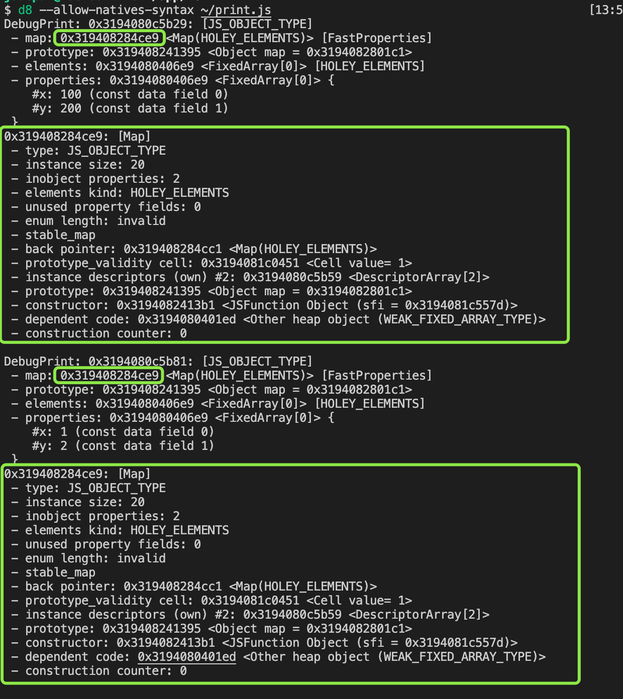

> 重新构建隐藏类 

触发条件：
1、对象创建好后，添加了新的属性

```

let point2 = {};
%DebugPrint(point2);
point2.x=1;
%DebugPrint(point2);
```
由下图可知，point新增x属性后，其map属性指向的地址由0x191d082802d9变为0x191d08284cc1:
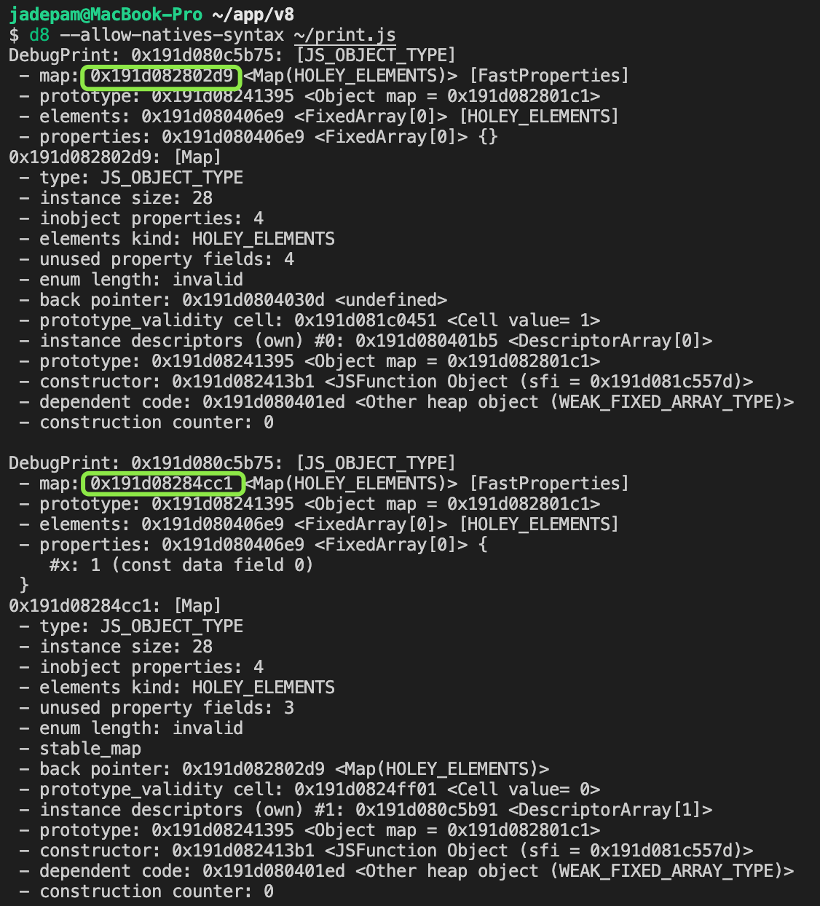

2、对象创建好后，删除了属性

//删除属性
```
let point = {x:100,y:200};
%DebugPrint(point);
delete point.x;
%DebugPrint(point);
```
由下图可知，point属性x被删除后，其map属性指向的地址由0x38e008284ce9变为0x38e0082832d1
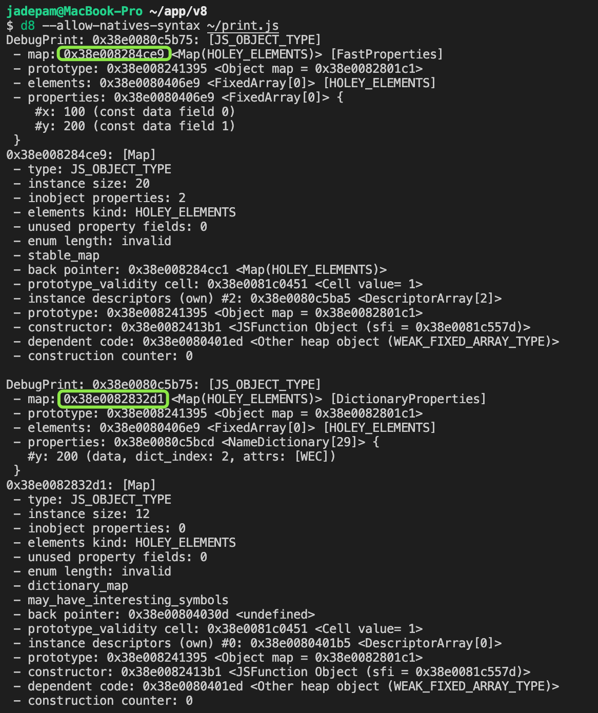

# v8是如何通过内联缓存来提升函数执行效率的
> 什么是内联缓存（Inline Cache）IC

# 消息队列：v8是如何实现函数回调的


> 回调函数

|   |回调函数 |
|---| ---  |
|定义| 某个函数做为参数，传递为另外一个执行函数（或宿主环境），并被调用|
|两种形式|1、同步回调：在执行函数内部被执行；2、异步回调：执行函数外部被执行|

> UI线程

| -  |UI线程 |
|---| ---  |
|定义| 指运行窗口的线程，js被设计运行在UI线程中|
|架构|  |
|任务| UI线程每次从消息队列中取出事件，执行事件的过程  |


> 异步回调函数

setTimeout
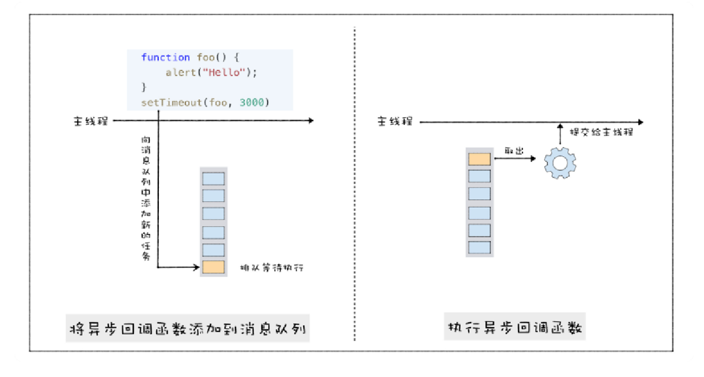

XMLHttpRequest，会分配给网络线程，类似情况：js 中获取设备信息、文件读取等异步API


# 异步编程：v8是如何实现微任务的

> 宏任务

消息队列中的等待被主线程执行的事件，执行时机是主线程执行完上一个宏任务，setTimeout；

> 微任务

微任务可以看成是一个需要异步执行的函数，执行时机是在主函数执行结束之后，当前宏任务结束之前；如：Promise.resolve、Promise.reject

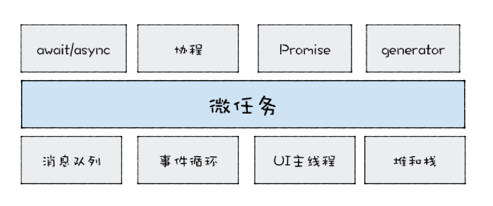

因为微任务依然是在当前的任务中执行的，所以微任务中**循环触发**新的微任务，会导致当前宏任务无法结束，即消息队列中的其他任务没有机会被执行

```
function foo(){
 return Promise.resolve().then(foo)
}
foo()
```

> 主线程、调用栈、消息队列

调用栈:一种数据结构，用来管理在主线程上执行的函数的调用关系（函数上下文&微任务队列），按照先进后出原则；调用栈中微任务队列，按照先进先出原则

消息队列:按照先进先出原则；

[MutationObserver](./code/index.html)接口提供了监视对DOM树所做更改的能力

# 异步编程：v8是如何实现async、await的
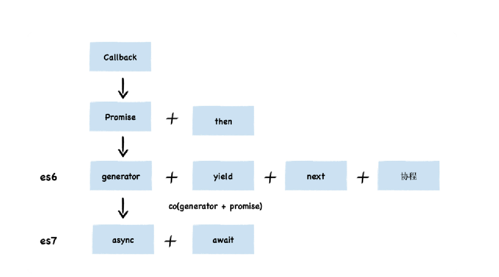
promise：

```
Promise.all = arr => {
    let aResult = [];    //用于存放每次执行后返回结果
    return new _Promise(function (resolve, reject) {
      let i = 0;
      next();    // 开始逐次执行数组中的函数(重要)
      function next() {
        arr[i].then(function (res) {
          aResult.push(res);    // 存储每次得到的结果
          i++;
          if (i == arr.length) {    // 如果函数数组中的函数都执行完，便resolve
            resolve(aResult);
          } else {
            next();
          }
        })
      }
    })
  };
```

生成器函数：是一个带*号的函数，配合yield实现函数暂停与恢复（协程控制）

执行器：执行生成器代码的函数，如：[co+generator](/book/1、网页三剑客/es6.md)中#10、symbol&generator

```
const co=(callback)=>{
    let cb=callback()//generator函数
    //递归得调用cb的next方法
    cb.next()
    function next(d){
        let result=cb.next(d)//value,done迭代器
        if(result.done) return
        result.value.then(data=>{
            next(data)
        })
        next()
    }
}
co(fn)
```

async、await：改进生成器的缺点，提供了在不阻塞主线程的情况下使用同步代码实现异步访问资源的能力；

async、await的原理：promise+生成器，微任务和协程；

async：一个通过异步执行并隐式返回Promise作为结果的函数；

await可以等待两种表达式：1、可以是任何普通表达式；2、可以是一个promise对象的表达式，此时会暂停执行生成器函数，直到promise对象状态变成resolve/reject，才会恢复执行，然后等到resolve/reject值，作为await表达式的运算结果；


# 垃圾回收：v8的两个垃圾回收器是如何工作的

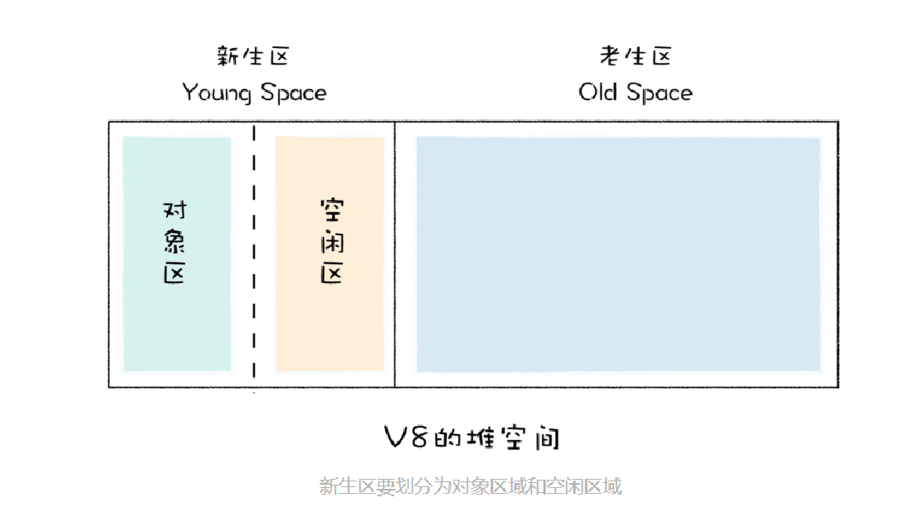

基于：代际假说，1、大部分对象是“朝生夕死”；2、不死的对象会活得更久，window、DOM等；

主垃圾回收器：Major GC，主要负责老生代的垃圾回收；

副垃圾回收器：Minor GC（Scavenger），主要负责新生代的垃圾回收；


# 垃圾回收：v8是如何优化垃圾回收器执行效率的
> V8 最开始的垃圾回收器有两个特点

第一个是垃圾回收在**主线程**上执行；
第二个特点是**一次执行一个完整的**垃圾回收流程。由于这两个原因，很容易造成主线程**卡顿**，所以 V8 采用了很多优化执行效率的方案。

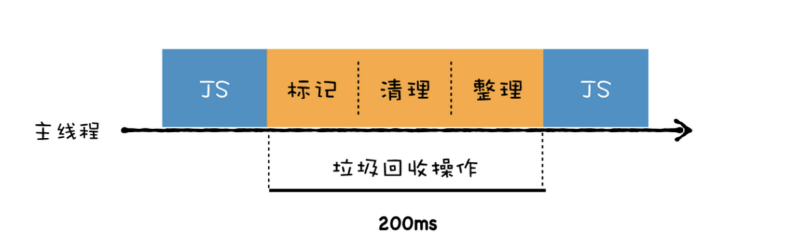

**全停顿（Stop-The-World）**:一旦执行垃圾回收算法，都需要将正在执行的 JavaScript 脚本暂停下来，待垃圾回收完毕后再恢复脚本执行。


> 两个角度：

第一，将一个完整的垃圾回收的任务拆分成多个小的任务，这样就消灭了单个长的垃圾回收任务；

第二，将标记对象、移动对象等任务转移到后台线程进行，这会大大减少主线程暂停的时间，改善页面卡顿的问题，让动画、滚动和用户交互更加流畅

> 三个方案：


并行回收:在执行一个完整的垃圾回收过程中，垃圾回收器会使用多个辅助线程来并行执行垃圾回收。
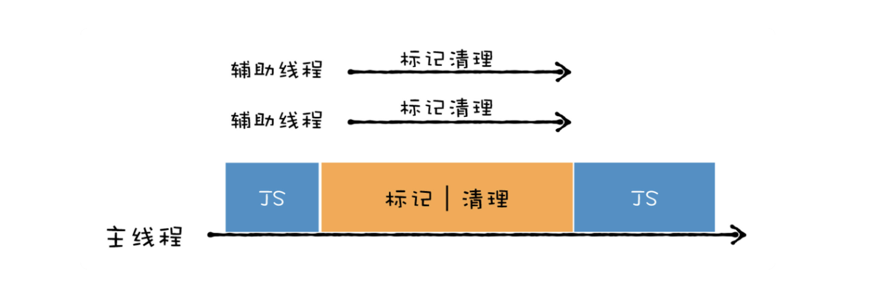

增量式垃圾回收:垃圾回收器将标记工作分解为更小的块，并且穿插在主线程不同的任务之间执行。采用增量垃圾回收时，垃圾回收器没有必要一次执行完整的垃圾回收过程，每次执行的只是整个垃圾回收过程中的一小部分工作。
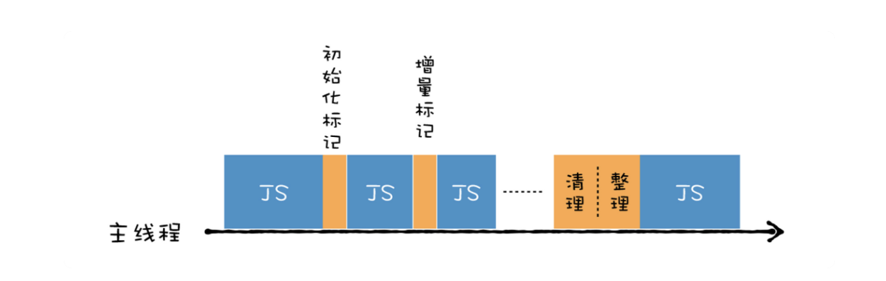

**三色标记法**：支持增量式垃圾回收；
约束条件：不能让黑色节点指向白色节点；使用**写屏障 (Write-barrier) 机制**实现这个约束条件

并发回收:回收线程在执行 JavaScript 的过程，辅助线程能够在后台完成的执行垃圾回收的操作。
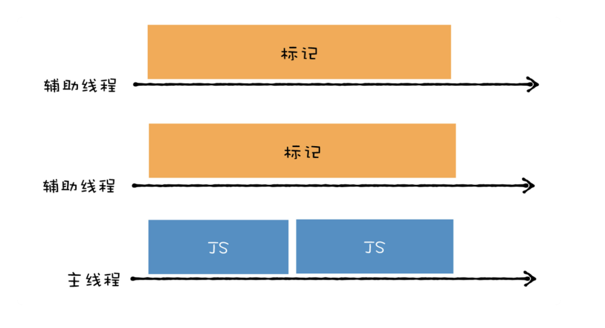

主垃圾回收器就综合采用了所有的方案，副垃圾回收器也采用了部分方案（并行策略）。
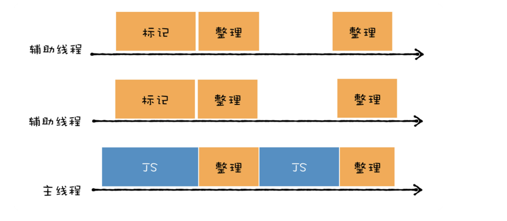

# 几种常见内存问题的解决策略

>内存泄漏 (Memory leak)：它会导致页面的性能越来越差

本质上，内存泄漏可以定义为：当进程不再需要某些内存的时候，这些不再被需要的内存依然没有被进程回收;

实例：
1、window 避免绑定多余值；
2、警惕闭包（缩小闭包范围）；
3、JavaScript 引用了 DOM 节点（detached），只有同时满足 DOM 树和 JavaScript 代码都不引用某个 DOM 节点，才会被回收

>内存膨胀 (Memory bloat)：它会导致页面的性能会一直很差

内存膨胀主要表现在程序员对内存管理的不科学；一次性加载过多资源；

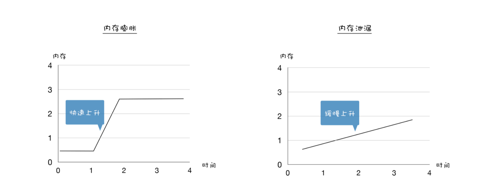

>频繁垃圾回收：它会导致页面出现延迟或者经常暂停

如：频繁创建临时变量，新生代内存（1-8M）内装满，触发垃圾回收，解决：临时变量设置为全局变量


# 如何构建和使用v8的调试工具d8
编译好的d8工具：
[mac平台](https://storage.googleapis.com/chromium-v8/official/canary/v8-mac64-dbg-8.4.109.zip)
[linux32平台](https://storage.googleapis.com/chromium-v8/official/canary/v8-linux32-dbg-8.4.109.zip)
[linux64平台](https://storage.googleapis.com/chromium-v8/official/canary/v8-linux64-dbg-8.4.109.zip)
[win32平台](https://storage.googleapis.com/chromium-v8/official/canary/v8-win32-dbg-8.4.109.zip)
[win64平台](https://storage.googleapis.com/chromium-v8/official/canary/v8-win64-dbg-8.4.109.zip)

执行命令需切换到d8目录，不然会报Failed to open startup resource 'snapshot_blob.bin'.

<hr>
JIT、作用域、词法环境、执行上下文

- 快速入门技术栈：
    知识的宏观架构
    过往历史
    优缺点
    结合个人整理技术栈

- js虚拟机：
    safari -javascriptcore
    firefox：tracemonkey
    chrome/node/dono：v8

- 技术栈：
    浏览器架构
    web网络
    事件循环机制
    js核心
    v8的内存管理
    浏览器的渲染流程
    web安全
    css
    react
    vue
    node
    构建工具链
