[TOC]
# 01-浏览器架构

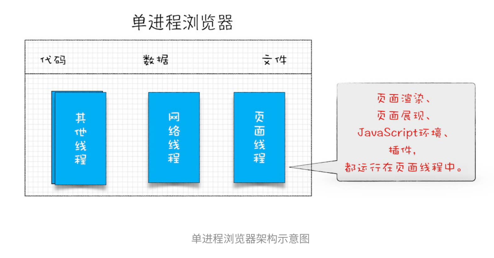
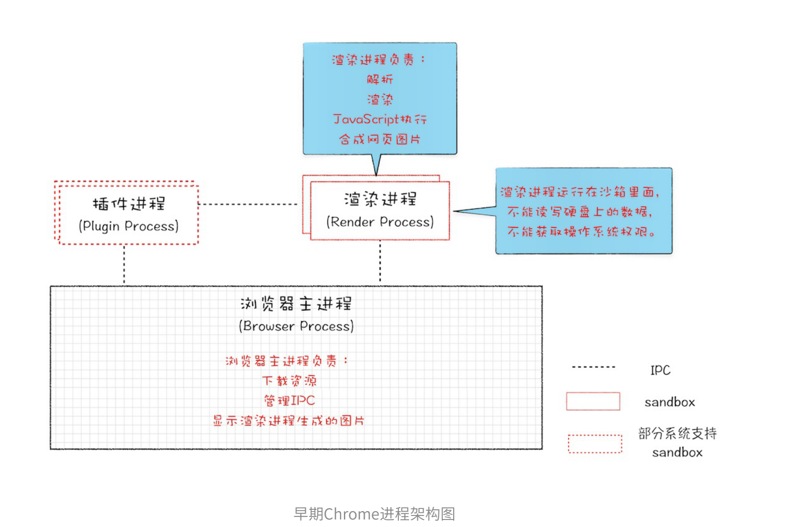
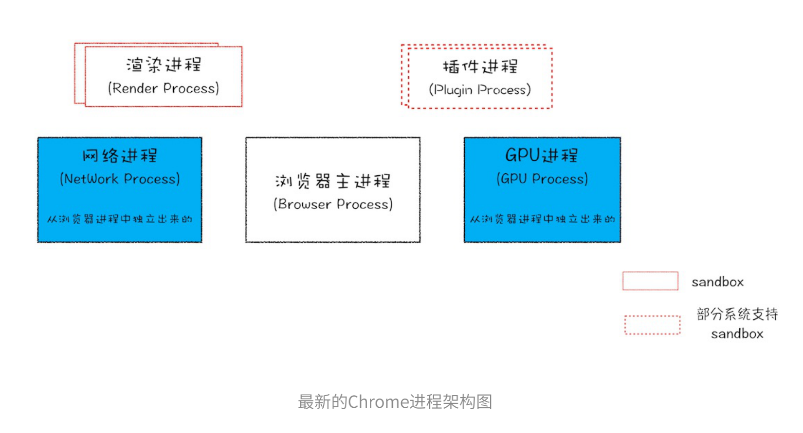
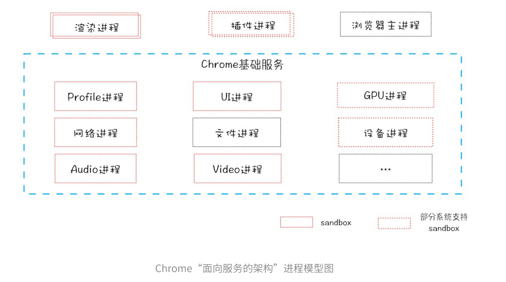

# 02-TCP协议：如何保证页面文件能被完整送达浏览器？
 - 互联⽹中的数据是通过数据包来传输的，数据包在传输-过程中容易丢失或出错。 
 - IP负责把数据包送达⽬的主机。 
 - UDP负责把数据包送达具体应⽤。
 - ⽽TCP保证了数据完整地传输，它的连接可分为三个阶段：建⽴连接、传输数据和断开连接。

# 03-HTTP请请求求流流程程：：为什么很多站点第⼆次打开速度会很快？

 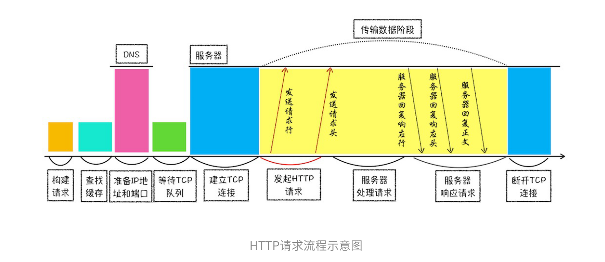

# 04-导航流程：：从输⼊URL到⻚⾯展⽰，这中间发⽣了什么？
 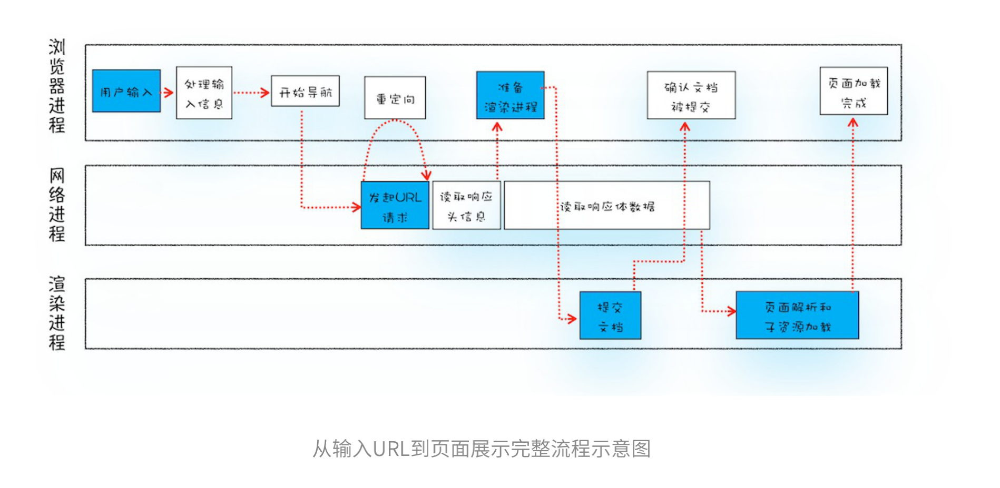
 
# 05-渲染流程（上）：HTML、CSS和JavaScript，是如何变成⻚⾯的？

 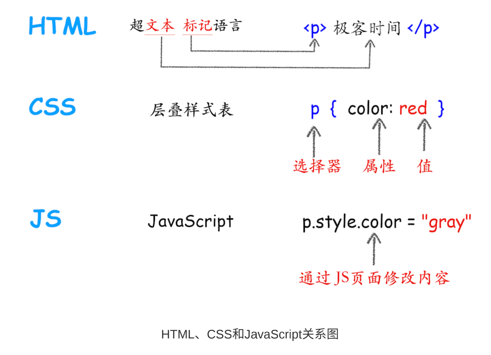

 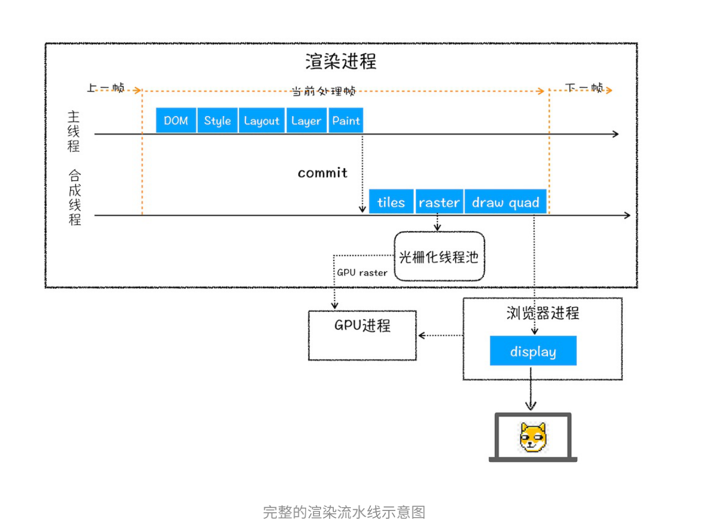

渲染事件顺序：构建DOM树、样式计算、布局阶段、分层、绘制、分块、光栅化和合成

1. 渲染进程将HTML内容转换为能够读懂的DOM树结构。 
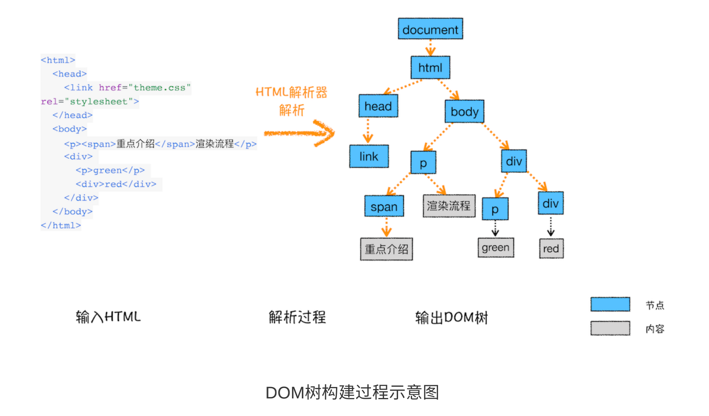

2. 渲染引擎将CSS样式表转化为浏览器可以理解的styleSheets，计算出DOM节点的样式。
 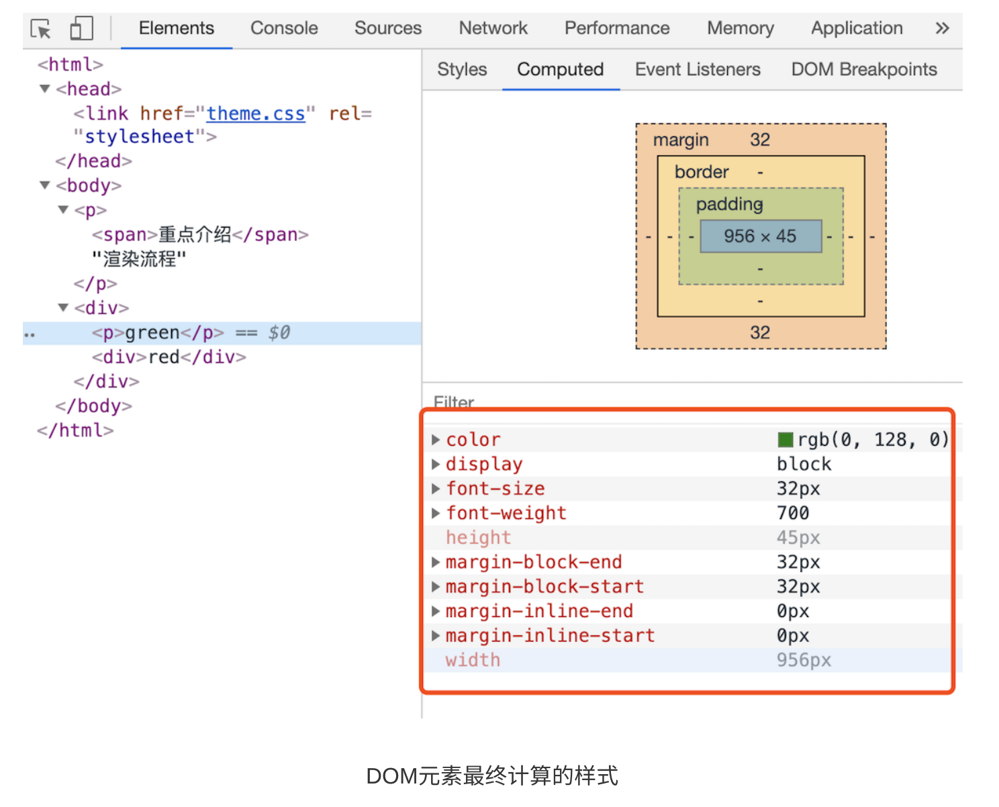

3. 创建布布局局树树，并计算元素的布局信息。
 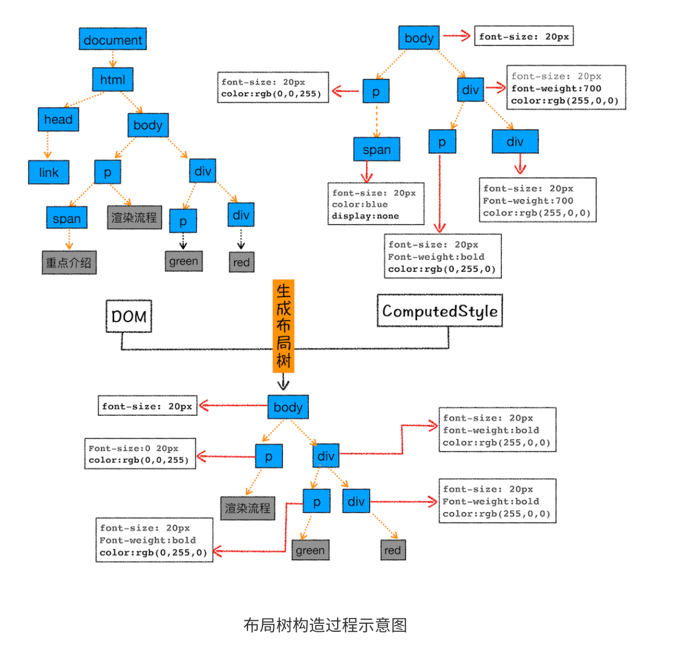

4. 对布局树进⾏分层，并⽣成分层树。 

 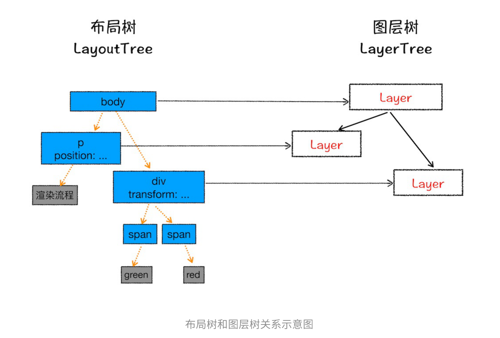

5. 为每个图层⽣成绘制列表，并将其提交到合成线程。 
6. 合成线程将图层分成图图块块，并在光栅化线程池中将图块转换成位图。 
 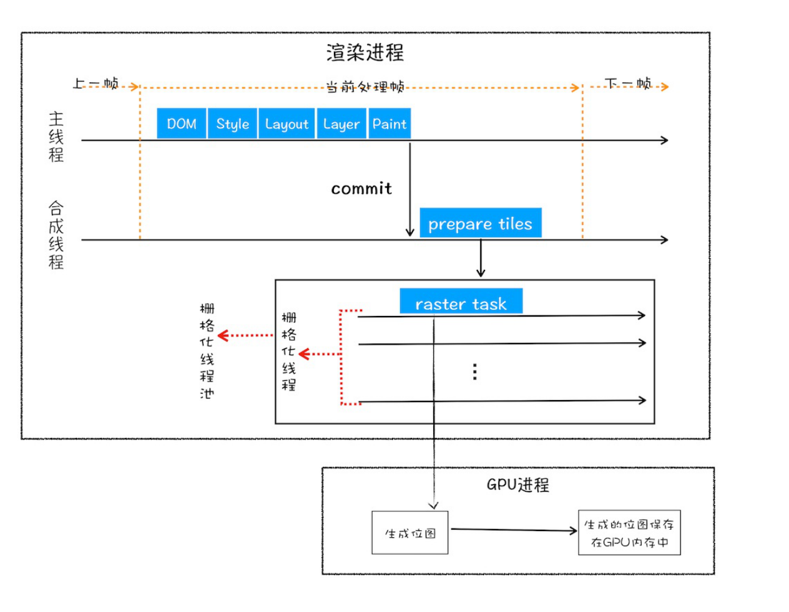

7. 合成线程发送绘制图块命令DrawQuad给浏览器进程。 
8. 浏览器进程根据DrawQuad消息⽣⽣成成⻚⻚⾯⾯，并显⽰到显⽰器上

> 相关概念

重排：修改元素的**⼏何位置**属性，例如改变元素的宽度、⾼度 等，那么浏览器会触发**重新布局**，解析之后的⼀系列⼦阶段，这个过程就叫重排。
 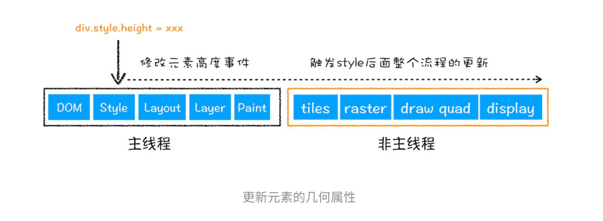

重绘:如果修改了元素的背景颜⾊，那么布局阶段将不会被执⾏，因为并没有引起⼏何位置的变换，所以就直接进⼊了绘制阶段，然后执⾏之后的⼀系列⼦阶段，这个过程就叫重绘。相较于重排操作，重绘省去了布局和和分层阶段
 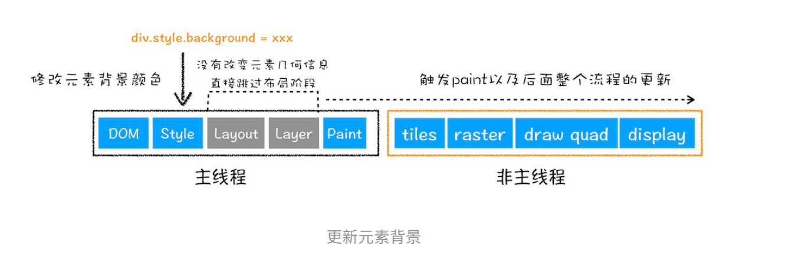

合成:使⽤了CSS的transform来实现动画效果，这可以避开重排和重绘阶段，直接在⾮主线程上 执⾏合成动画操作。这样的效率是最⾼的，因为是在⾮主线程上合成，并没有占⽤主线程的资源，另外也避开了布局和绘制两个⼦阶段。
 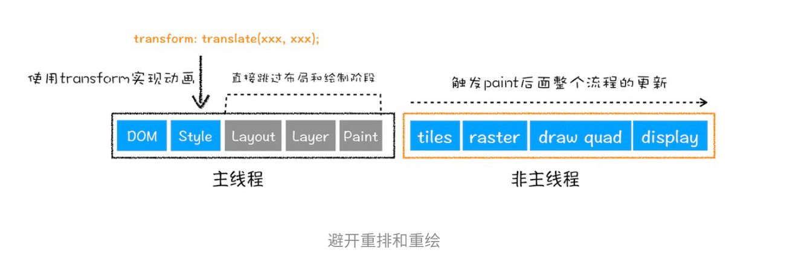

# 15--重剑⽆锋，，⼤巧不⼯：：javascript面向对象

> 封装

> 继承

> 多态