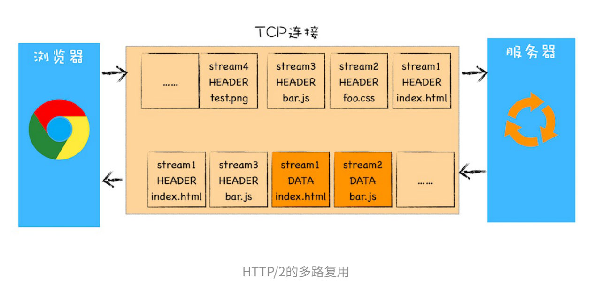
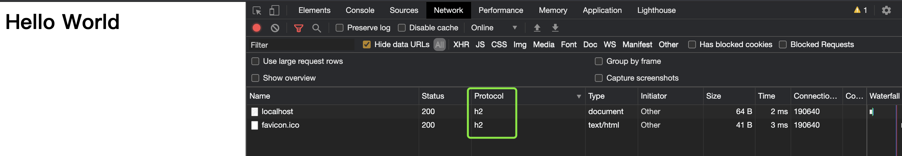
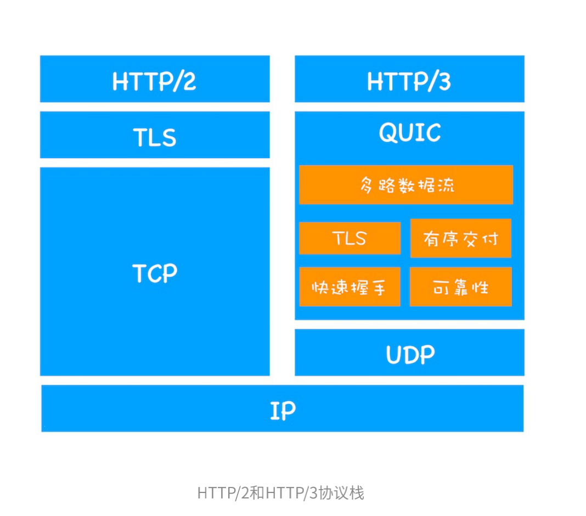
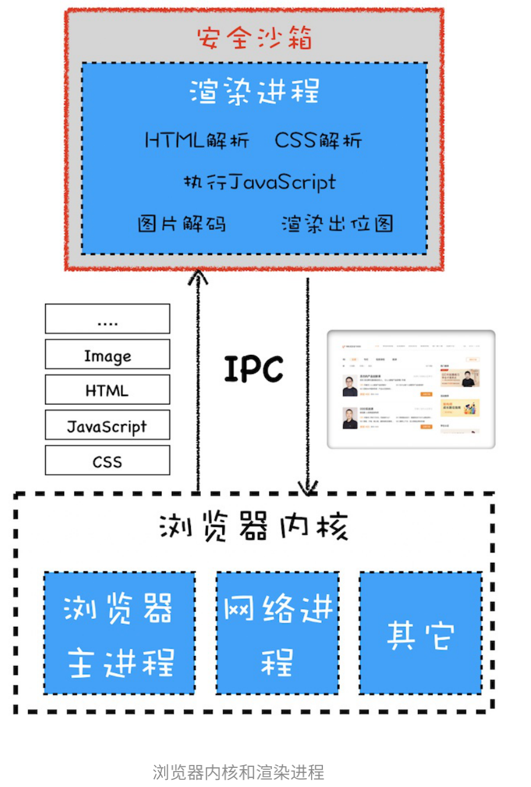
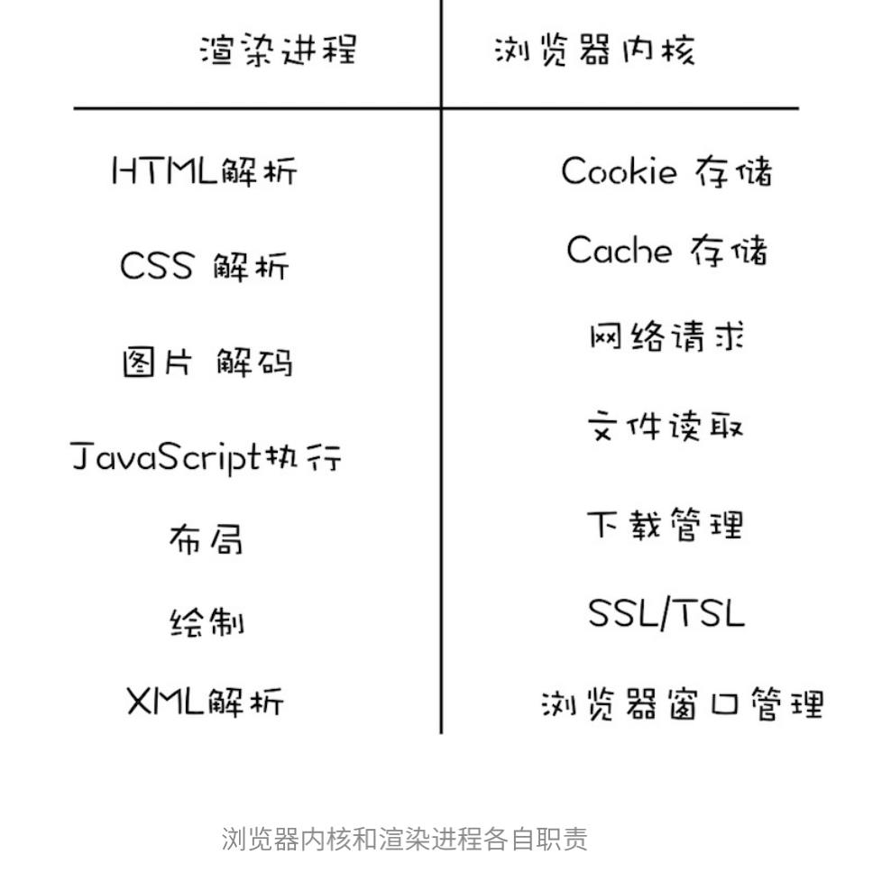
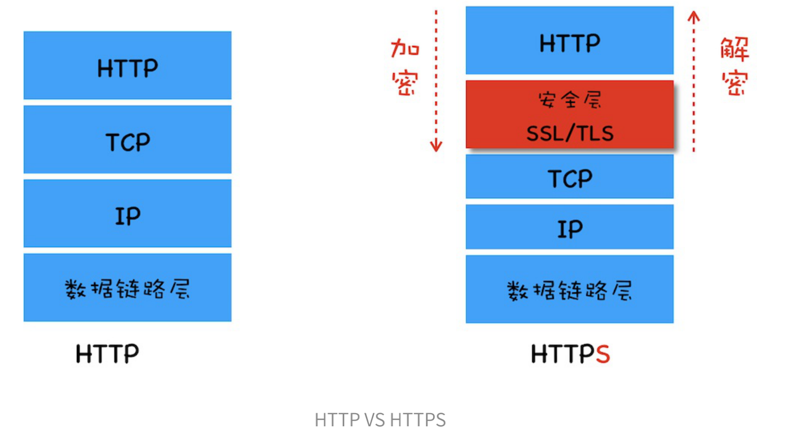
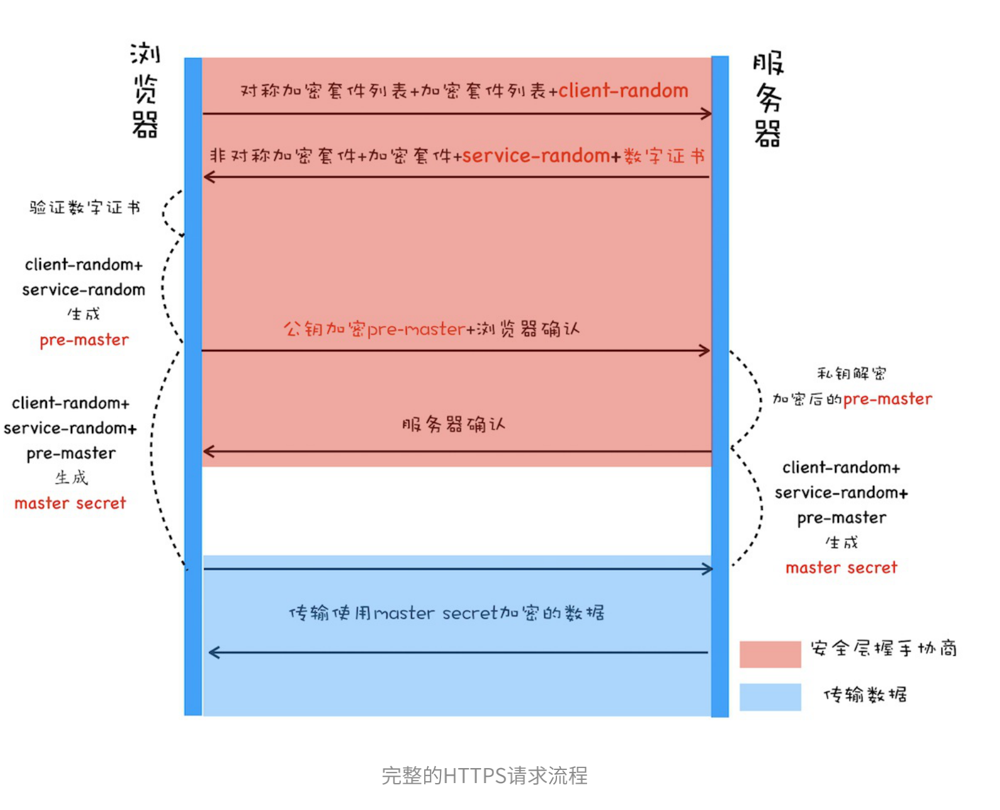

[TOC]

# 宏观视角下的浏览器
## 01-浏览器架构


## 02-TCP协议：如何保证页面文件能被完整送达浏览器？
 - 互联⽹中的数据是通过数据包来传输的，数据包在传输-过程中容易丢失或出错。 
 - IP负责把数据包送达⽬的主机。 
 - UDP负责把数据包送达具体应⽤。
 - ⽽TCP保证了数据完整地传输，它的连接可分为三个阶段：建⽴连接、传输数据和断开连接。

## 03-HTTP请求流程：为什么很多站点第⼆次打开速度会很快？

 


## 04-导航流程：从输⼊URL到⻚⾯展⽰，这中间发⽣了什么？
 
 
## 05-渲染流程：HTML、CSS和JavaScript，是如何变成⻚⾯的？

 

 

渲染事件顺序：构建DOM树、样式计算、布局阶段、分层、绘制、分块、光栅化和合成


1. 渲染进程将HTML内容转换为能够读懂的DOM树结构。 


2. 渲染引擎将CSS样式表转化为浏览器可以理解的styleSheets，计算出DOM节点的样式。
 

3. 创建布局树，并计算元素的布局信息。
 


4. 对布局树进⾏分层，并⽣成分层树。 

 

5. 为每个图层⽣成绘制列表，并将其提交到合成线程。 

6. 合成线程将图层分成图图块块，并在光栅化线程池中将图块转换成位图。 

 

7. 合成线程发送绘制图块命令DrawQuad给浏览器进程。 

8. 浏览器进程根据DrawQuad消息⽣⽣成成⻚⻚⾯⾯，并显⽰到显⽰器上


> 相关概念

重排：修改元素的**⼏何位置**属性，例如改变元素的宽度、⾼度 等，那么浏览器会触发**重新布局**，解析之后的⼀系列⼦阶段，这个过程就叫重排。
 

重绘:如果修改了元素的背景颜⾊，那么布局阶段将不会被执⾏，因为并没有引起⼏何位置的变换，所以就直接进⼊了绘制阶段，然后执⾏之后的⼀系列⼦阶段，这个过程就叫重绘。相较于重排操作，重绘省去了布局和和分层阶段
 

合成:使⽤了CSS的transform来实现动画效果，这可以避开重排和重绘阶段，直接在⾮主线程上 执⾏合成动画操作。这样的效率是最⾼的，因为是在⾮主线程上合成，并没有占⽤主线程的资源，另外也避开了布局和绘制两个⼦阶段。
 


# 浏览器中的js执行机制
## 15--重剑⽆锋，⼤巧不⼯：javascript面向对象

> 封装

> 继承

> 多态
 
# v8工作原理
# 浏览器中的页面循环系统

# 浏览器中的页面
## Chrome开发者⼯具：利用网络面板做性能分析
# 浏览器中的网络

> http1.1

    改进：
    1. 增加了持久连接； 
    2. 浏览器为每个域名最多同时维护6个TCP持久连接； 
    3. 使⽤CDN的实现域名分⽚机制。

    问题：
    1、TCP的慢启动
    2、同时开启了多条TCP连接，那么这些连接会竞争固定的带宽
    3、HTTP//1.1队头阻塞的问题

>http2.0

多路复用：⼀个域名只使⽤⼀个TCP⻓连接和消除队头阻塞问题（并⾏请求）




>http3.0：UDP协议




# 浏览器中的安全

## 浏览器同源策略&常见攻击
> 浏览器安全可分成三块：**web页面安全**、浏览器网络安全、浏览器系统安全

同源策略（same origin policy）：协议、域名和端口号相同

同源策略三个层⾯的主要表现：
- DOM：同源策略限制了来⾃不同源的JavaScript脚本对当前DOM对象读和写的操作
- Web数据：同源策略限制了不同源的站点读取当前站点的Cookie、IndexDB、- LocalStorage等数据。
- ⽹络：同源策略限制了通过XMLHttpRequest等⽅式将站点的数据发送给不同源的站点

Web在出让安全性⽅⾯主要是允许**嵌⼊第三⽅资源**、**跨域资源共享**：
|  | 允许嵌⼊第三⽅资源 | 跨域资源共享|
|  --- | ---  | --- |
| 常见问题 | xxs攻击 |通过XMLHttpRequest或ajax发送跨域请求，导致多余的OPTIONS请求 |
| 问题原因 | 外部注入恶意脚本 | 【同源策略】|
| 预防手段  | 1、网页安全政策 （Content Security Policy）CSP,由服务端来决定可以加载哪些第三⽅资源；2、使⽤HttpOnly属性；3、服务器对输⼊脚本进⾏过滤或转码 |[CORS]((https://developer.mozilla.org/zh-CN/docs/Web/HTTP/CORS))处理 |
| 具体方法  |1、使用meta标签；2、在服务端配置csp（优先级更高）|1、避免跨域；2、请求降级|


CORS 预检请求：OPTIONS请求

```
//curl查看接口对请求方法以及一些header的使用允许情况
$ curl -X OPTIONS http://local-life-api.locallife.test.hcinner/api/ -i                                                                                                                           [15:29:38]
HTTP/1.1 204 No Content
Access-Control-Allow-Credentials: true
Access-Control-Allow-Headers: DNT,X-CustomHeader,Keep-Alive,User-Agent,X-Requested-With,If-Modified-Since,Cache-Control,Content-Type,Content-Range,Range,Charset,X-Access-Token,X-Appid,X-Client-Info,X-Client-Version,X-Sign,X-T,X-V,X-Ver
Access-Control-Allow-Methods: GET, POST, OPTIONS
Access-Control-Expose-Headers: X-Datetime, X-Timestamp
Access-Control-Max-Age: 3600
Content-Type: text/plain; charset=utf-8
Date: Wed, 03 Mar 2021 07:29:45 GMT
Server: nginx
```
跨⽂档消息机制：可通过window.postMessage的JavaScript接⼝来和不同源的DOM进⾏通信


> xss攻击

存储型xss攻击
反射型xss攻击
基于DOM的xss攻击

> CSRF攻击（Cross-site request forgery）跨站请求伪造

发起攻击的三个条件：
- 第⼀个，⽬标站点⼀定要有CSRF漏洞； 
- 第⼆个，⽤⼾要登录过⽬标站点，并且在浏览器上保持有该站点的登录状态； 
- 第三个，需要⽤⼾打开⼀个第三⽅站点，可以是⿊客的站点，也可以是⼀些论坛

避免攻击的几种方法：
- 充分利用好set-cookie的samesite属性
- 服务器验证请求的来源站点，Origin（优先级高）>Referer
- CSRF Token

## 35-安全沙箱：页面和系统之间的隔离墙，站点隔离

 
 

## 36--HTTPS：让数据传输更安全



安全层有两个主要的职责：1、对发起HTTP请求的数据进⾏加密操作；2、对接收到HTTP的内容进⾏解密操作。
两种加密方式：1、对称加密，传输数据；2、非对称加密：对称加密的密钥
数字证书的两个作用：1、⼀个是通过数字证书向浏览器证明服务器的⾝份；2、另⼀个是数字证书⾥⾯包含了服务器公钥

