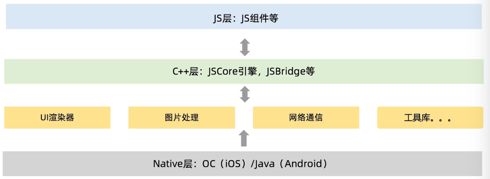
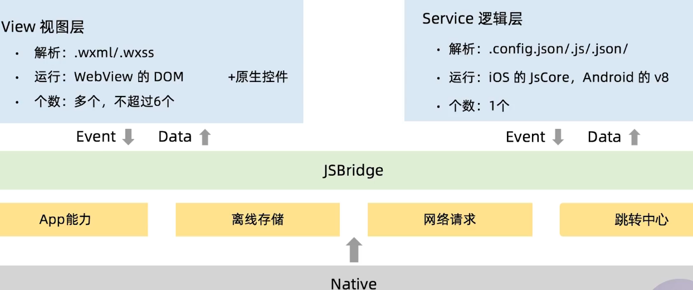

[toc]

# 1、静态资源

## 图片
>图片格式

|  | jpeg | png| svg| gif| Webp|
|  --- | ---  | --- |--- |--- | ---|
| 介绍 | 栅格图形，彩色照片有损压缩|栅格图形，无损压缩，保留图像质量，有透明度|矢量图形，与 JPEG 和 GIF比尺寸更小，且可压缩性更强 |栅格图形，8位色（256种颜色），仅支持支持透明与不透明，通用动画 |现代图像格式，无损比png小26%；有损比jpeg小25-34%，比gif有更好的动画|
| 不适合 | 线条形和文字、图标图形，不透明|无损压缩，不适合彩色图像|复杂图形 |每像素只有8比特，不适合存储彩色图片 |最多处理256色，不适合彩色图片|
| 适合 | 色彩丰富、彩色大焦点图、通栏banner；结构不规则的图形|色彩颜色少，纯色、透明、线条绘图，需透明de|字体、移动端矢量图标|动画、图标|图形和半透明图片|
|  压缩 | node-pngquant-native  | jpegtran |--|gifsicle  | ---|

> 其他优化方法：

- 1、图片尺寸随网络环境变化
    url后缀加不同参数
- 2、响应式图片
    js、css媒体查询、img srcset属性
- 3、逐步加载图像
    统一占位符、LQIP与SQIP（部署在服务器上或者在webpack项目中配置）

> 图片**服务自动**优化

开源库：[imageproxy](https://docs.imgproxy.net/#/installation)

- 定义：图片url链接加不同特殊参数，服务器自动化生产，不同格式、大小、质量的图片

- 处理方式：
    - 图片裁剪：按长边、短边、填充、拉伸等缩放
    - 图片格式转化：jpg、gif、png、webp，支持不同图片的压缩率
    - 图片处理：水印、高斯模式、中信处理、裁剪边框
    - AI能力： 鉴黄以及智能抠图、智能排版、智能配色、智能合成等AI功能

## html

- 1、精简html代码
- 2、文件位置
    css：放页面头，css加载不会阻塞DOM Tree解析，但是会阻塞DOM Tree渲染，也会阻塞后面js执行；
    js：一版放在页面底部，这是防止js的加载和解析阻塞页面元素的正常渲染；
- 3、用户体验
    favicon.ico；首屏必要css与js；可以增加背景图或者loading或者骨架屏，比空白页好很多；

## css优化细则

- 1、提升css渲染性能


- 2、合理使用web fonts


- 3、css动画优化


## JavaScript优化

提升js文件的加载性能
这个基本每个人都知道，就是css文件放在head标签中，js文件放在body结尾的地方。这个是js的加载不要影响html的渲染。

变量和函数方面的优化
尽量使用id选择器，因为id选择器在查询效果上效率最快。

避免使用eval，这个方法比较消耗能行。

js函数尽可能保持简洁，不要把太多内容写在一个函数中。也建议使用事件的节流函数。事件委托等等。

js动画
尽量避免添加大量的js动画，css3动画和canvas动画都比js动画性能好。

使用requestAnimationFrame来代替setTimeout和setInterval，因为requestAnimationFrame可以在正确的时间进行渲染，setTimout和setInterval无法保证渲染时机。不要在定时器里面绑定事件。


## 减少页面回流和重绘

css：避免频繁设置样式

js：避免频繁操作Dom

## 简化DOM操作

## 静态文件
- 压缩
html-minifier: 压缩html 
clean-css: css的压缩工具 
uglify-js: js文件的压缩工具
- 打包
公共组件拆分
压缩：js/css/图片
合并：js/css文件合并，css sprite
combo：js/css文件，服务端处理，  combo http://cdn.com/??a.js,b.js内容

- 版本号更新


# 2、页面渲染

## 浏览器渲染过程

## 页面加载策略：懒加载，预加载，预渲染

|  | 定义| 好处| 实际方式和示例|
|  --- | ---  | --- |--- |
|  懒加载 | 懒加载也叫延迟加载，指的是长页面中延迟加载特定元素（图片、js、css，js中特定函数和方法，以下简称“懒加载元素”|减少当前屏无效资源的加载|真实src属性写在data-lazy属性中，滚动监听scroll，如懒加载元素在可视区，则src属性或者URL路径设置成data-lazy属性 |
|  预加载| 让浏览器预先加载将来会被使用的资源 | 减少用户后续加载资源等待的时间 |1、html标签，display：none等；2、Image对象；3、preload<link rel="preload" href="https://example.com/fonts/font.woff" as="font" crossorigin> ；prefetch<link rel="prefetch" href="/uploads/images/pic.png">；<link rel="dns-prefetch" href="//fonts.googleapis.com">；preconnent<link href="https://cdn.domain.com" rel="preconnect" crossorigin>|
|  预渲染 | ---  | --- |<link rel="prerender" href="https://www.keycdn.com">|
|  预渲染 | ---  | --- |--- |
## 接口服务调用优化
- 1、接口合并
    这个是指一个页面的众多的业务接口和依赖的第三方接口统一使一个部署在集群的接口统一调用，以减少页面接口请求数
- 2、接口上CDN
    主要基于接口性能考虑，我们可以把不需要实时更新的接口同步至CDN，等此接口内容变更之后同步至CDN集群上。如果一定时间内未请求到数据，会用源站接口再次请求。
- 3、接口域名上CDN
    增强可用性、稳定性
- 4、接口降级
    这个基于大促备战考虑，核心接口进行降级用基础接口进行业务实现，比如千人千面的推荐接口，在大促时间点可以直接运营编辑的数据。另外接口万一无法访问，使用预设好的垫底备份数据。
- 5、接口监控
    监控接口成功率，不是常说的TP99，而是和用户实际情况一致的成功和失败监控，包括比如弱网、超时
    网络异常、网络切换等情况。排查出来问题需要联合后端、运维、网络岗位人员一并解决。

## 接口缓存优化
- 1、Ajax/fetch缓存
    前端请求时候带上cache，依赖浏览器本身机制
- 2、本地缓存
    异步接口数据优先使用本地localStorage中的缓存数据
- 3、多次请求
    接口数据本地无localStorage缓存数据，重新再次发出ajax请求

# 3、原生app优化

## 如何选择合适的WebView内核

> ios内核
|  | ios UIwebView| ios wkwebview|
|  --- | ---  | --- |
| 优点| 1、从ios2开始作为app内展示web内容的容器；2、排版布局能力强  | 1、苹果在WWDC2014上推出的新一代webview组件；2、wkwebview的内存开销比UIwebview小很多；3、在性能、稳定性、占用内存方面有很大提升；4、高达60fps的滚动刷新率；5、自身就支持了右滑返回手势；6、支持了更多的html的属性；7、内存占用是UIWebView的1/4～1/3；8、加载速度比UIWebView提升了一倍左右；9、更为细致地拆分了UIWebViewDelegate中的方法；10、允许javaScript的Nitro库加载并使用（UIWebView中限制）大大提高了页面js执行速度；11、可以和js直接互调函数，不像UIWebView需要第三方库WebViewJavaScriptBridge来协助处理和js的交互 |
|  缺点| 1、内存泄露；2、极高内存峰值；3、TouchDelay（300ms延迟）；4、js的运行性能和通信限制；5、2018年ios12以后已经被标记为Deprecated不再维护  | 1、不支持页面缓存，需要自己注入Cookie，而UIWebView是自动注入Cookie；2、无法发送POST参数问题 |

> Android webKit 和Chromium
 
|  | webkit for webview| chromium for webview|备注 |
| 版本 | Android4.4以下  | Android4.4已上  |- |
| js解释器 | WebCore JavaScript | V8 |--- |
| H5 | 278  | 434|--- |
|  远程调试 | 不支持 | 支持 |Android4.4及以上支持 |
|  内存占用 | 小  | 大 |相差20-30M左右|
|  webAudio | 不支持  | 支持 |Android5.0及以上支持|
|  webGL |不支持 |支持 |Android5.0及以上支持|
|  webRTC | 不支持  | 支持 |Android5.0及以上支持|

> Android第三方
- [X5内核]
    - 1、速度快：相比系统webview的网页打开速度有30+%的提升
    - 2、省流量：使用云端优化技术使流量节省20+%
    - 3、更安全：安全问题可以在24小时内修复
    - 4、更稳定：经过亿万级用户的使用考验，CRASHE率低于0.15%
    - 5、兼容好：无系统内核的碎片化问题，更少的兼容性问题
    - 6、体验优：支持夜间模式、适屏排版、字体设置等浏览增强功能
    - 7、功能全：在H5、ES6上有更完整支持
    - 8、更强大：集成强大的视频播放器，支持视频格式远多于系统WebView
    - 9、视频和文件格式的支持X5内核多于系统内核
    - 10、防劫持是X5内核的一大亮点

## WebView性能优化

### 1、浏览器优化：如何设置全局WebView？.mp4
> 启动过程
- 当App首次打开时，默认是并不初始化浏览器内核的；
- 当创建webview实例的时候才会启动浏览器内核（打开时间需要70～700ms），并创建webview的基础框架
> 实施步骤
- 使用全局webview进行优化
- 在客户端刚启动时，就初始化一个全局的webview待用，并隐藏
- 当用户访问了webview时，直接使用这个webview加载对应的网页，并展示
> 具体流程
- 在初始化页面上创建全局webview
- 根据页面跳转流向，确定目标网页
- 利用全局webview，加载目标网页对应的基础文件
- 向服务器发送请求消息，请求目标网页对应的网页数据
- 将请求到的网页数据渲染到初始化页面上
- 运行状态切换为退出状态时，销魂webview
>选型建议
- 技术好处：减少首次打开webview时间
- 不足之处：额外的一点内存消耗
### 2、浏览器优化：如何实现导航栏预加载？.mp4
>导航栏预加载
- 原来：在webview加载完成之后进行初始化（同步）
- 现在：和webview并行一起加载（异步）

### 3、浏览器优化：如何打通登录态？.mp4
> 打通登陆态
- 原来：html5页面上接口每次查询，cookies里面是否有登陆态，无登陆态html5跳转统一登陆页，app拦截统一登陆页，进入原生登陆，原生登陆成功，在浏览器写登陆态cookies
- 现在：cookies由app发统一登陆接口并埋上登陆态cookies，并且在cookies有效时间内无需再次请求登陆接口

### 4、浏览器优化：如何实现URL预加载？.mp4
> url预加载
- 原来：所有准备好再请求页面
- 现在：准备和请求页面同步进行，URLload和动画并行加载
### 5、浏览器优化：如何提升滚动条的使用体验？.mp4
>提升滚动条的使用体验
- 原来：采用系统自带滚动条
- 现在：模拟wifi下页面加载过程，让用户感觉页面加载变快了

### 6、浏览器优化：如何对JS-SDK进行优化？.mp4
> js-sdk优化
- 原来：1、scheme长度有限制；2、iframe依赖jssdk.js文件
- 现在：webkit无依赖jssdk.js文件，直接调用
### 7、浏览器优化：目前主流的缓存策略有哪些？.mp4

> 浏览器缓存策略

| 缓存机制| 优势| 适用场景| Android开关| iOS开关|
|  --- | ---  | --- |--- |--- |
| 浏览器缓存机制 | HTTP协议层支持  | 静态文件的缓存 |浏览器复杂 |浏览器负责 | 
| web Storage | 较大存储空间，使用简单 | 临时、简单数据的缓存，浏览器上的local Storage、sessionStorage |webSettings.setDomStorageEnabled(true) | 无 | 
| Web SQL Database | 存储、管理复杂结构数据  | 建议用IndexedDB |webSettings.setDatabaseEnabled(true) | 无 | 
| Application Cache | 方便构建离线App  | 离线App、静态文件缓存 |webSettings.setAppCacheEnabled(true)|无 |
| IndexedDB | 存储任何类型数据、使用简单，支持索引  | 结构、关系复杂的数据存储 |webSettings.setJavaScriptEnabled(true)| 无 | 


## H5离线化的实现方式

> 离线包架构

　

> 离线包下载

- 如果用户处于移动网络下，不会在后台下载离线包；
- 如果当前永华点击app，离线包没有下载好，用户就要等待离线包下载好才能用

> 离线包运行模式

- 请求包信息：从服务端请求离线包信息存储到本地数据库的过程。离线包信息包括离线包的下载地址、离线包版本号
加密/签名信息等。

- 下载离线包：把离线包从服务端下载到手机

- 安装离线包：下载目录，拷贝到手机安装目录

> 大厂离线包方案

- 美团：LsLoader-通用移动端WebApp离线化方案
- 腾讯：Alloykit-手Q离线包
- 阿里：极致的Hybrid- 航旅离线包再加速

## 混合开发介绍 

> 愿景:学习一次，写在任何地方

> 技术优势

- 技术

    代码共享，ios和android 只编写一套代码（多端映射）
    性能方面，与native几乎相同
    动画方面：reactnative提供；饿非常流畅的动画。因为之前渲染之前的代码已经转换为原生视图

- 效率
    调试时，无需每次代码变更都在编译打包，可即时查看更改
    ios、android2人力变成1人力
- 发版
    支持热更新，不用每次发版都发布应用商店
    发版时间自由控制，支持ios、android平台同一时间发布
    
　

## 小程序
> 愿景

触手可及、用完即走

> 技术优势

- H5相比APP开发，开发门槛更低
- 优于h5，接近native体验
- 相机、位置、网络、存储等丰富的原生能力
- 顶部拉下，搜索、扫码等入口，用完即走，简单方便
- 不用像app那样下载，直接打开退出即可，支持热更新


## **Flutter**
> 技术优势
- 编写一次，即可部署各终端：web、Android/ios、mac/linux/windows、fuchsia os
- 底层使用Skia图形引擎，图形性能媲美原生应用
- 界面像一款全屏应用程序或2D游戏
- 速度快，使用本机ARM二进制文件，提前编译，不需要JVM

　

> 行业背景

- App平台侧：流量变现、小程序生态、类应用分发市场
- 企业应用侧：移动流量枯竭，新流量红利；解决部分获🉑️难问题，极低的拉新成本；大幅降低开发成本；业务上更多的试错机会


# 4、服务端与网络层面

## CDN
内容分发网络：利用最靠近每位用户的服务器，更快、更高效的将文件发送给用户分发网络。
提速、低成本、高可用性

CDN回源：浏览器访问CDN集群上静态文件时，文件缓存过期，直接穿透CDN集群而访问源站机器的行为。

三级缓存：浏览器本地缓存、CDN边缘节点缓存、CDN源站缓存；

缓存设置：缓存时间设置的过短，CDN边缘节点缓存经常失效，导致频繁回源，增大了源站负载，访问也慢；缓存时间设置的过长，文件更新慢，用户本地缓存不能及时更新；所以结合业务情况而定。

不同静态资源类型缓存时间：
html：3分钟；
js、css：10分钟、1天、30天；

```
location ~ \.(gif|jpg|jpeg|png|bmp|ico)$ {
    root /var/www/img/;
    expires 30d;
}
```

> CDN灰度发布

原理：在部分地区的部分运营商优先发布静态资源，验证通过后，再进行全量发布；

实施：域名方面，设置特殊VIP解析至灰度的城市、运营商；源站机器方面，给灰度的城市、运营商配置单独源站机器；灰度的城市、运营商解析至这些特有机器上。

> CDN大促备战

- 增加机房带宽
- 增加运营商流量
- 灾备：CDN应用缓存时间由10分钟设置成1小时，大促后恢复
 

## DNS
域名系统：域名与ip的映射关系

Android DNS模块okhttp
ios DNS

前端并发数限制，分布设置成多个域名
用户访问：java、php等api接口
页面和样式：html/js/css
图片：jpg、png、gif等

## http优化：减少http请求数
CSS Sprites
图片使用DataURI、Web Font
JS/CSS文件合并
JS/CSS请求Combo
接口合并
接口存储LocalStorage
静态资源存储LocalStorage

## cookie

> 策略：
- 主战首页设置白名单，cookie**key字段**白名单
- 定期删除非白名单cookie

> 好处

- 减少页面间传输大小
- 对cookie进行有效管理

## 服务器缓存配置

- expires:响应头，时间/日期，会受到时差与电脑时间的影响，cache-control设置max-age或者s-max-age时会被忽略
- cache-control：通用消息头字段，max-age=<seconds>，时间相对请求的时间，缓存指令是单项的在请求中设置指令，不一定被包含在响应中。no-cache会进行协商缓存，no-store则不缓存；
- Etag:<etag_value>，**响应**头，类似指纹hash，文件修改时间+文件大小+文件名等信息，对应标签：if-none-match，下次请求时请求头带上，发送给服务器，进行时间对比
- Last-Modified：时间/日期，**响应**头；对应标签：if-Modified-since，下次请求时**请求**头带上，发送给服务器，进行时间对比


> 状态码status

100-199：信息响应
200-299：成功响应
300-399：重定向
400-499：客户端错误
500-599:服务端错误

## gzip压缩

> 好处

- 对文本进行压缩（http/css/js）
- 对非文本**不压缩**（jpg/gif/png）
- 压缩比例约50%—70%

> niginx 配置

- nignx配置：gzip on
- Apache配置：AddOutputFilterByType和AddOutFilter 

> 检测

Response header 查看是否有Content-Encoding:gzip


## https
经过http进行通信，但利用SSL/TLS进行加密；主要目的是对服务器身份认证，保护数据隐私和完整性。

> 流程：

1、浏览器发起请求=》
2、服务器生成私钥、公钥，传证书（包含公钥）给浏览器=》
3、浏览器检验证书，并生产随机值（client key），即对称加密的密钥=》
4、浏览器将加密之后的客户端密钥发送给服务器（注意：密钥是**非对称加密**）=》
5、服务器收到客户端的密文，用私钥对其进行**非对称解密**，取得客户端密钥，并用客户端密钥对数据进行**对称加密**生成密文，并将密文发送给客户端=》
6、客户端收到服务器发送来的密文，用本地密钥进行**对称解密**

nginx配置：
```
server{
    listen 443 ssl;
    ssl_certificate *.pem;
    ssl_certificate_key *key.pem;
}
```
## http2
特点：
1、二进制格式传输数据
2、多路复用，允许通过一个http/2连接发起多个请求
3、对header头压缩，传输体积小
4、服务推送，服务端能够更快的把资源推送给客户端

优点：降低服务器压力、提升访问速度，保护网站安全

nginx：
1、升级openssl
2、 nginx重新编译并安装，--with-http_ssl_module、--with-http_v2_module
3、nginx配置 server配置https后，在listen 443 ssl 后加http2

# 5、研发开发流程优化

## 前端的研发流程

- 技术选型（页面渲染技术和混合式开发技术）
- 项目初始化（React、Vue、Angular）
- 依赖模块引入（私有NPM）
- 本地开发（自研前端工具）
- 项目联调
- 效果确认（产品、设计确认）
- 项目上线（部署系统）

## 协作模式

- 前后端制定数据接口
- 前端页面制作
- 前端交互实现
- 后端开发
- 前后端联调
- 前端上线
- 后端上线

## 自动化测试

ui自动化：上手简单，不过稳定性差，工具：appium（原生或混合移动应用（ hybrid mobile apps ）的自动化测试工具）、robot framework（端到端）、selenium（web应用，浏览器兼容性）、airtest（跨平台多端）
接口自动化：文档，性价比非常高，工具：java+restassured，python+requests，JMeter，HttpRunner等
单元测试：性价比极高，一般由开发完成，但是有一些单元测试框架，比如：Junit5（java），pytest（python），unittest。

## 自动化上线

- 拉取代码库代码
- 自动化工具在线打包编译
- 代码上线部署至灰度机器
- 代码上线部署至线上全量机器
- cnd后台静态文件更新缓存

## 代码质量

制定代码规范（小组或者团队内）
静态代码扫描（可以在上线系统里增加流程）
CodeReview（高工或者小组内）
阅读框架核心源码（站在巨人肩膀上）


# 6、质量监控体系

## 一、上线前

### 1、页面错误
- js报错
- 接口报错
- 线上环境检测
- 页面白屏

### 2、页面性能
- 页面完全加载时间检测
- 前端html、js、css压缩检测
- 前端大html、js、css、大图检测
- 前端js、css个数检测
- 服务器Gzip检测
- 服务器缓存设置检测

### 3、页面安全
- http和https检测
- xss检测 

### 4、页面卡口
- 运营（运营平台）
- 研发（上线平台）

## 二、上线后
### 1、页面性能监控

- js错误监控
- api接口监控
- 日志详情
- 用户轨迹

### 2、统计报表

- 大盘走势
- 地域
- 运营商
- 浏览器

### 3、页面管理

页面url所归属的部门、研发人员

### 4、性能指标

### 5、报警服务

## 三、线上业务基调监控

- 竞品分析
- **多点**监控
- 告警服务

## 四、发版后app性能和错误监控

- 网络请求
- 启动监控
- 崩溃监控
- 页面监控
- 网络监控
- webview监控
- 报警服务
