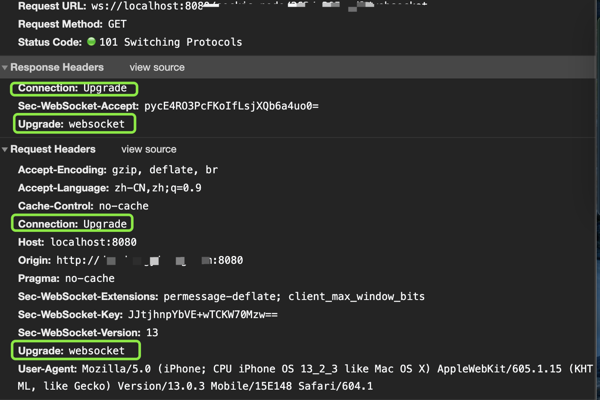

**websocket**本质上还是建立在**tcp**协议之上的，与http相比的优势是，建立通信后，服务端可以向客户端主动发送消息。没有同源限制，客户端可以与任意服务器通信。不过，WebSocket只支持文本和二进制数据,推送消息。

>  客户端
```
var ws = new WebSocket("wss://localhost:8181");
//向服务端发出建立链接请求，并ws.send发送消息
ws.onopen = function(evt) { 
  console.log("Connection open ..."); 
  ws.send("Hello WebSockets!");
};
//监听服务端，ws.send发送消息操作
ws.onmessage = function(evt) {
  console.log( "Received Message: " + evt.data);
  ws.close();//向服务端发送断开链接请求
};

//监听服务端断开链接操作
ws.onclose = function(evt) {
  console.log("Connection closed.");
};      
```

> 服务端（node）
```
var WebSocketServer = require('ws').Server,
    wss = new WebSocketServer({
        port: 8181
    }); //服务端口8181


wss.on('connection', function (ws) {
    //监听客户端ws.onopen建立请求操作
    var sendMessage = function (ws) {
        if (ws.readyState == 1) {
           ws.send(JSON.stringify(speedObj)); //需要将对象转成字符串。WebSocket只支持文本和二进制数据,推送消息
           console.log("服务器：更新数据", JSON.stringify(speedObj));
        }
    }
    ws.on('message', function (message) {
       //监听客户端ws.send发送消息操作
       var stockRequest = JSON.parse(message); //根据请求过来的数据来更新。
       console.log("服务器：收到消息", stockRequest);
       sendMessage(ws)
    });
    ws.on('close', function () {
        //监听客户端ws.close()断开操作
    });
});

```

>专用头字段



```
状态：101//表示握手成功

//Request Headers请求头
Connection: Upgrade//专用头字段
Sec-WebSocket-Extensions: permessage-deflate; client_max_window_bits//扩展，有压缩和window_bit选项说明
Sec-WebSocket-Key: JJtjhnpYbVE+wTCKW70Mzw==//base64编码16字节随机数，简单认证密钥，要求 服务端必须返回一个对应加密的"Sec-WebSocket-Accept"应答
Sec-WebSocket-Version: 13//协议版本号
Upgrade: websocket////专用头字段

//Response Headers响应头
Connection: Upgrade//专用头字段
Sec-WebSocket-Accept: pycE4RO3PcFKoIfLsjXQb6a4uo0=//是服务端采用 与客户端一致的 密钥计算出来后返回客户端的
Upgrade: websocket//专用头字段
```

