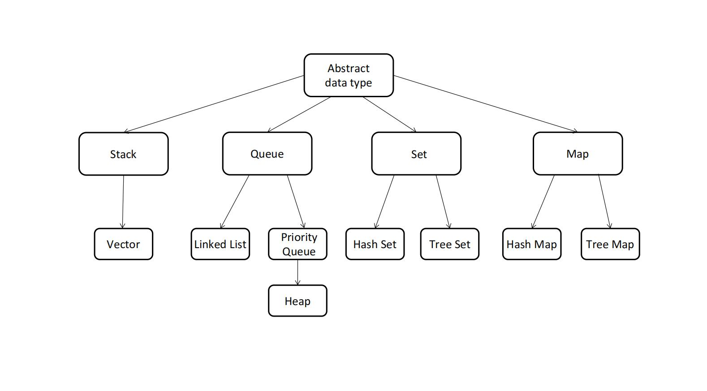
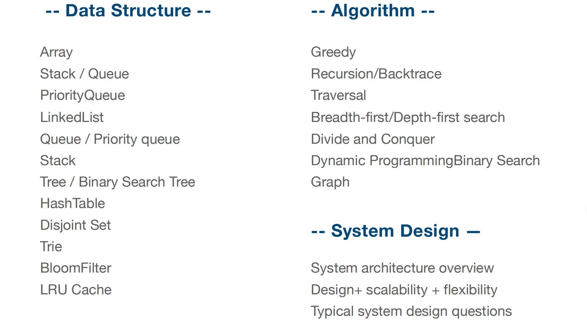

# 理论知识
- 算法与数据结构
<div style="width:800px">
    
    <div>
        
        
    </div>
</div>


- 时间复杂度


     时间复杂度中的log（n）底数到底是多少？


    假设有底数为2和3的两个对数函数，如上图。当X取N（数据规模）时，求所对应的时间复杂度得比值，即对数函数对应的y值，用来衡量对数底数对时间复杂度的影响。

    比值为log2 N / log3 N，运用换底公式后得：(lnN/ln2) / (lnN/ln3) = ln3 / ln2，ln为自然对数，显然这是个常数，与变量N无关。

    用文字表述：算法时间复杂度为log（n）时，不同底数对应的时间复杂度的倍数关系为常数，不会随着底数的不同而不同，因此可以将不同底数的对数函数所代表的时间复杂度，当作是同一类复杂度处理，即抽象成一类问题。
    
    ps:换底公式，log10=或loge X = lnX

- 数组与链表

    操作| Array | Linked List&Doubly Linked List |
    - | :-: | :-: | 
   Array | O(1) | O(N) | 
    int | O(N)| O(1)| 
    del |O(N)| O(1) | 

  

# leetcode题目练习
- 1. [Two Sum](https://leetcode.com/problems/two-sum/)
   - 数组nums中，若两数之和等于target，返回两数下标。map对象转化存储数组val:index，循环数组nums，当target-nums[i]包含在map中时，返回[map[target-nums[i]], i]
   ```
   const twoSum = (nums, target) => {
    const map = {};
    for (let i = 0; i < nums.length; i++) {
      const another = target - nums[i];
  
      if (another in map) {
        return [map[another], i];
      }
  
      map[nums[i]] = i;
    }
  
    return null;
  };
   ```
## 链表&算法
- 24. [Swap Nodes in Pairs](https://leetcode.com/problems/swap-nodes-in-pairs/)
   - 链表相邻数反转：

- 25. [Reverse Nodes in k-Group](https://leetcode.com/problems/reverse-nodes-in-k-group/)
- 141. [Linked List Cycle](https://leetcode.com/problems/linked-list-cycle/)
    - 判断是否有环：
- 142. [Linked List Cycle II](https://leetcode.com/problems/linked-list-cycle-ii/)
- 206. [Reverse Linked List](https://leetcode.com/problems/swap-nodes-in-pairs/)
 - 链表翻转
```
var reverseList = function(head) {
    let cur = head
    let next = head
    let prev = null
    while(cur){
        next =next.next  
        cur.next = prev 
        prev = cur      
        cur= next  
    }
    return prev
}
```

## 其他
- 146. [LRU 缓存机制](https://leetcode-cn.com/problems/lru-cache/)


[code](./code/Lru.js)
```
class LRUCache{
    constructor(capacity){
        this.capacity=capacity
        this.cache=new Map()
    }
    put(key,value){
        if(this.cache.has(key)){
            this.cache.delete(key) && this.cache.set(key, value);
        } else if (this.cache.size >= this.capacity){
            // 缓存超过最大值，则移除最近没有使用的
            this.cache.delete(this.cache.keys().next().value)
        }
        this.cache.set(key, value);
        return this.cache
    }
    get(key){
        if(this.cache.has(key)){
            const v=this.cache.get(key)
            this.cache.delete(key) && this.cache.set(key, v);
            return v
        }else{
            return -1
        }
    }
}
```

- 567. [Permutation in String](https://leetcode.com/problems/permutation-in-string/)


  
