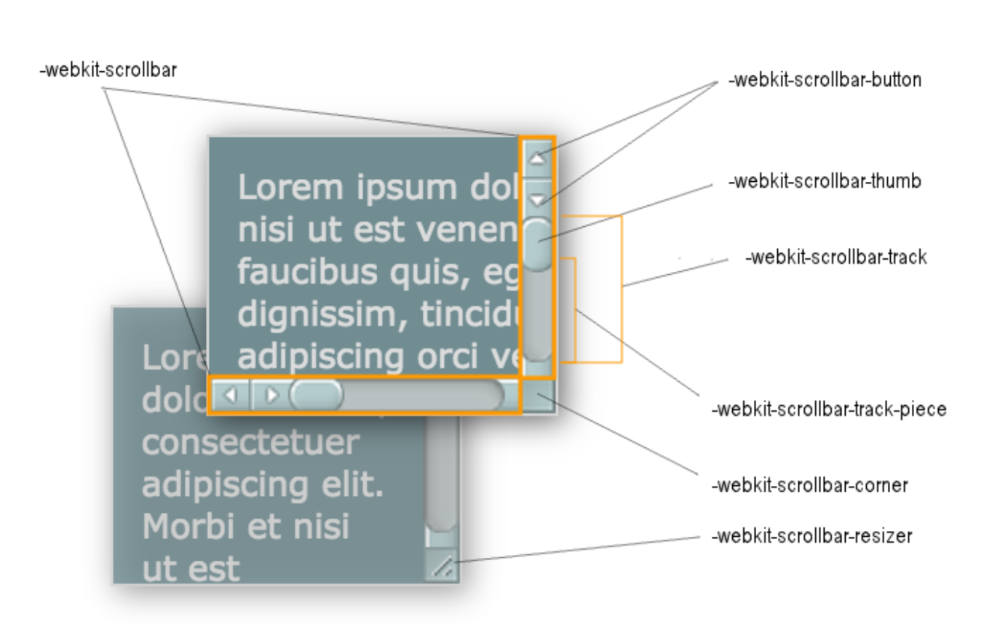
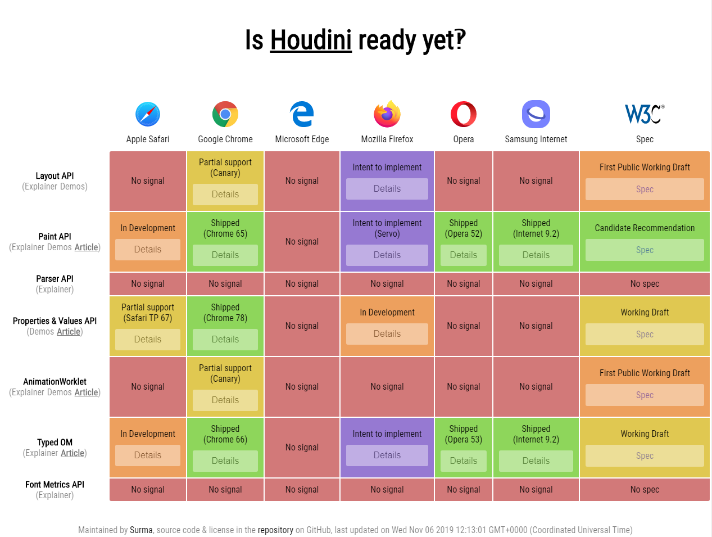

### 1.css3 技巧

-   早期的双飞翼布局+假等高 +CSS HACK、zoom 缩放

    原理 margin 不影响盒子宽度

    ```
     <section>
        <div>
            <div class="center">
            </div>
        </div>
        <div>
        </div>
        <div>
        </div>
    </section>
      1、2、3:表示DOM顺序，均float:left

      1 width:100%，子元素margin-left:2的宽度，margin-right:3的宽度,原理margin不影响盒子宽度

      2 margin-left:-100%

      3 margin-left:-本身宽度
    ```

    假等高（解决等高问题）

    ```

        height: 9999px;
        margin-bottom: -9999px;
    ```

    CSS HACK

    ```
    1、IE6怪异解析之padding与border算入宽高  原因：未加文档声明造成非盒模型解析  解决方法：加入文档声明<!doctype html>
    2、IE6在块元素、左右浮动、设定marin时造成margin双倍（双边距）  解决方法：display:inline
    3、以下三种其实是同一种bug，其实也不算是个bug，举个例子：父标签高度20，子标签11，垂直居中，20-11=9，9要分给文字的上面与下面，怎么分？IE6就会与其它的不同，所以，尽量避免。  1）字体大小为奇数之边框高度少1px  解决方法：字体大小设置为偶数或line-height为偶数  2）line-height，文本垂直居中差1px  解决方法：padding-top代替line-height居中，或line-height加1或减1  3）与父标签的宽度的奇偶不同的居中造成1px的偏离  解决方法：如果父标签是奇数宽度，则子标签也用奇数宽度;如果是父标签偶数宽度，则子标签也用偶数宽度
    4、内部盒模型超出父级时，父级被撑大 解决方法：父标签使用overflow:hidden
    5、line-height默认行高bug 解决方法：line-height设值
    6、行标签之间会有一小段空白 解决方法：float或结构并排(可读性差，不建议)
    7、标签高度无法小于19px 解决方法：overflow: hidden;
    8、左浮元素margin-bottom失效 解决方法：显示设置高度 or 父标签设置_padding-bottom代替子标签的margin-bottom or 再放个标签让父标签浮动，子标签 margin- bottom，即(margin-bottom与float不同时作用于一个标签)
    9、img于块元素中，底边多出空白 解决方法：父级设置overflow: hidden; 或 img { display: block; } 或 _margin: -5px;
    10、li之间会有间距  解决方法：float: left;
    11、块元素中有文字及右浮动的行元素，行元素换行  解决方法：将行元素置于块元素内的文字前 12、position下的left，bottom错位  解决方法：为父级(relative层)设置宽高或添加*zoom:1
    13、子级中有设置position，则父级overflow失效  解决方法：为父级设置position:relative

    ```

    zoom 缩放

    ```
    实践：cssicon.space:https://designresearch.space/#/
    ```

-   基于移动端的 PX 与 REM 转换兼容方案

    ```
    different size  different DPR

    目前的设计稿 一般是 640 750 1125，一般要先均分成100份，(兼容vh,vm) 750/10 = 75px。div宽是240px*120px css的书写改为3.2rem * 1.6rem。 配合响应式修改html根的大小。

    字体不建议使用rem的，data-dpr属性动态设置字体大小。屏幕变大放更多的文字，或者屏幕更大放更多的字。

    神奇的padding/margin等比例缩放间距:设置百分比，会继承父元素宽度
    ```

-   弹性盒模型与 Reset 的选择

```
flex模型 *的杀伤力太大！！！
Reset.css 重置 Normalize.css修复 Neat.css融合
html{box-sizing: border-box;} *,*:before,X:after{box-sizing: inherit;}

```

-   自制的 ICON-FONT

```
no-image时代 不超过纯色为2的图像
宋体非宋体 黑体非黑体 WIndows下的宋体叫中易宋体SimSun，Mac是华文宋体STSong。WIndows下的黑体叫中易黑体SimHei，Mac是华文黑体STHeiti。
不要只写中文字体名，保证西文字体在中文字体前面。Mac->Linux->Windows
切忌不要直接使用设计师PSD的设计font-family,关键时刻再去启动font-face（typo.css 、 Entry.css 、Type.css ）
font-family: sans-serif;系统默认，字体多个单词组成加引号。
CSS ICON:http://cssicon.space/#/ 、underline-js
```

-   CSS 代码检测与团队项目规范

```
1.不要使用多个class选择元素，如a.foo.boo，这在ie6及以下不能正确解析
2.移除空的css规则，如a{}
3.正确的使用显示属性，如display:inline不要和width，height，float，margin,padding同时使用，display:inline-block不要和float 同时使用等
4.避免过多的浮动，当浮动次数超过十次时，会显示警告
5.避免使用过多的字号，当字号声明超过十种时，显示警告
6.避免使用过多web字体，当使用超过五次时，显示警告
7.避免使用id作为样式选择器
8.标题元素只定义一次
9.使用width:100%时要小心
10.属性值为0时不要写单位
11.各浏览器专属的css属性要有规范， 例如.foo{-moz-border-radius:5px;border-radius:5px}
12.避免使用看起来像正则表达式的css3选择器
13.遵守盒模型规则

```

-   CSS 绘制特殊图形 高级技巧
    clip 裁剪支持动画
    outline+box-shadow 0.4，解决 border-radius 弧度填补问题
    贝塞尔曲线
    border && border-radius 造就万千可能
    after && before 任何一个 HTML 元素都可以创造 3 个可以供我们操作的视觉元素，即三个矩形。

    box-shadow 是可以定义为任意颜色的，并且同一个元素可以投射出不同的 box-shadow。
    borders 构建的三角形

-   BFC IFC GFC FFC

```
FC的全称是：Formatting Contexts，是W3C CSS2.1规范中的一个概念。它是页面中的一块渲染区域，并且有一套渲染规则，它决定了其子元素将如何定位，以及和其他元素的关系和相互作用。

BFC

BFC(Block Formatting Contexts)直译为"块级格式化上下文"。Block Formatting Contexts就是页面上的一个隔离的渲染区域，容器里面的子元素不会在布局上影响到外面的元素，反之也是如此。如何产生BFC？

根元素

float的值不为none。

overflow的值不为visible。

position的值为absolute或fixed，不为relative和static。

display的值为table-cell, table-caption, inline-block中的任何一个。


那BFC一般有什么用呢？比如常见的多栏布局，结合块级别元素浮动，里面的元素则是在一个相对隔离的环境里运行。

Box垂直方向的距离由margin决定。属于同一个BFC的两个相邻Box的margin会发生重叠。

清除内部浮动：计算BFC的高度时，内部浮动元素也参与计算

自适应两栏布局:BFC的区域不会与float box重叠

IFC

IFC(Inline Formatting Contexts)直译为"内联格式化上下文"，IFC的line box（线框）高度由其包含行内元素中最高的实际高度计算而来（不受到竖直方向的padding/margin影响)

IFC中的line box一般左右都贴紧整个IFC，但是会因为float元素而扰乱。float元素会位于IFC与与line box之间，使得line box宽度缩短。 同个ifc下的多个line box高度会不同。 IFC中时不可能有块级元素的，当插入块级元素时（如p中插入div）会产生两个匿名块与div分隔开，即产生两个IFC，每个IFC对外表现为块级元素，与div垂直排列。

那么IFC一般有什么用呢？

水平居中：当一个块要在环境中水平居中时，设置其为inline-block则会在外层产生IFC，通过text-align则可以使其水平居中。

垂直居中：创建一个IFC，用其中一个元素撑开父元素的高度，然后设置其vertical-align:middle，其他行内元素则可以在此父元素下垂直居中。

GFC

GFC(GridLayout Formatting Contexts)直译为"网格布局格式化上下文"，当为一个元素设置display值为grid的时候，此元素将会获得一个独立的渲染区域，我们可以通过在网格容器（grid container）上定义网格定义行（grid definition rows）和网格定义列（grid definition columns）属性各在网格项目（grid item）上定义网格行（grid row）和网格列（grid columns）为每一个网格项目（grid item）定义位置和空间。

那么GFC有什么用呢，和table又有什么区别呢？首先同样是一个二维的表格，但GridLayout会有更加丰富的属性来控制行列，控制对齐以及更为精细的渲染语义和控制。

FFC

FFC(Flex Formatting Contexts)直译为"自适应格式化上下文"，display值为flex或者inline-flex的元素将会生成自适应容器（flex container），可惜这个牛逼的属性只有谷歌和火狐支持，不过在移动端也足够了，至少safari和chrome还是OK的，毕竟这俩在移动端才是王道。

Flex Box 由伸缩容器和伸缩项目组成。通过设置元素的 display 属性为 flex 或 inline-flex 可以得到一个伸缩容器。设置为 flex 的容器被渲染为一个块级元素，而设置为 inline-flex 的容器则渲染为一个行内元素。

伸缩容器中的每一个子元素都是一个伸缩项目。伸缩项目可以是任意数量的。伸缩容器外和伸缩项目内的一切元素都不受影响。简单地说，Flexbox 定义了伸缩容器内伸缩项目该如何布局。

```

- 滤镜filter:hue-rotate(0deg)

 
- - 字体裁剪&背景色透明，[渐变过渡字体](./../code/css/fort.html)
```
   @keyframes hue
        {
            from{
                filter: hue-rotate(0deg)
            }
            to{
                filter: hue-rotate(360deg)
            }
        }
        .yd-slogon{
            font-size: 120px;
            -webkit-background-clip: text;
            -webkit-text-fill-color: transparent;
            background-image: linear-gradient(
                to right,
                red,
                orange,
                yellow,
                green,
                cyan,
                blue,
                purple
            );
            animation: hue 2s linear infinite;
        }
```

- - 混合模式background-blend-mode
 
- - 滤镜(filter颜色+hue-rotate)的双向应用，[支持css动画](./../code/css/filter.html)

- 分栏：resize + scrollbar
- -webkit-scrollbar [自定义滚动条](./../code/css/scroll.html)


- 滚动的临界点scroll-snap-align
- 蒙版效果（遮罩） -webkit-mask-image
- shape-outside多边形文字环绕

### 2.css3d&html5

HTML5: 地理位置 \ 重力感应 \ 陀螺仪

1.deviceorientation
设备的物理方向信息，表示为一系列本地坐标系的旋⻆度

```
window.addEventListener("deviceorientation",
function(event)	{
	//	处理event.alpha、event.beta及event.gamma
},	true)
z轴为轴，alpha的作用域为(0, 360)。
x轴为轴，beta的作用域为(-180, 180)。
y轴为轴，gamma的作用域为(-90, 90)。

```

2.devicemotion
提供设备的加速信息

```
window.addEventListener("devicemotion",
function(event)	{
			//	处理event.acceleration
			//	 x(y,z):设备在x(y,z)方向上的移动加速度值
			//event.accelerationIncludingGravity
			//考虑了重力加速度后设备在x(y,z)
			//	event.rotationRate
	 //alpha,beta,gamma:设备绕x,y,z轴旋转的⻆度
},	true);

```

3.compassneedscalibration
用于通知 Web 站点使用罗盘信息校准上述事件

```
window.addEventListener(“compassneedscalibrati
on",	function(event)	{
						alert('您的罗盘需要校准');
						event.preventDefault();
		},	true);
```

4、window.navigator.geolocation

```
1.getCurrentPosition()获取当前位置信息
2.watchPosition()监视位置变化，和1参数一样
3.clearWatch()清除位置监视
```

[CSS3 3D 模型]()

[结合 Touch 事件](./../code/css/touch.html)

```
  Touch事件一般有三个

  touchstart ：当手指触摸屏幕的回调，即使是一只手指头。
  touchmove：手指在屏幕上滑动时触发。
  touchend：当手指从屏幕上移开时触发。
```

[CSS3D 库](./../code/css/3D.html) :css3d-engine.js()

### 3.css 矩阵 matrix()和matrix3d()

矩阵数学概念\CSS 中矩阵应用复杂的 CSS 矩阵


### 4.[css houdini/js in css ](https://css-houdini.rocks/)


[兼容性](https://ishoudinireadyyet.com)

6.css 重绘 重排 

### 7.css next
[css-doodle/css in js](https://css-doodle.com/)

9.css 分层理论 oocss acss bem