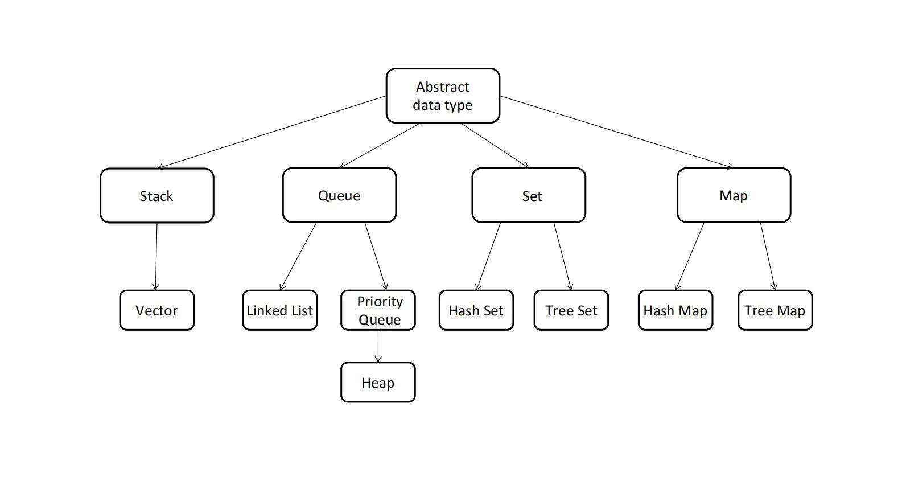
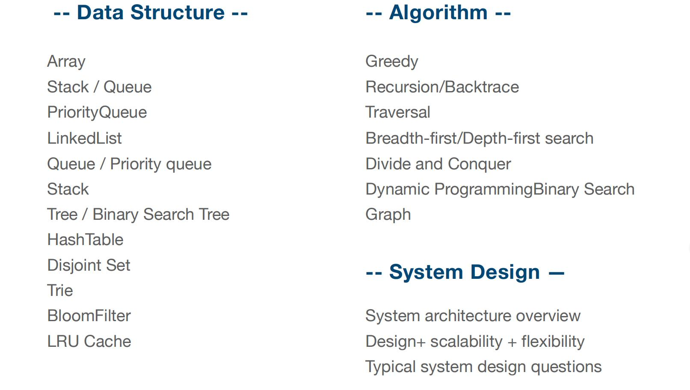
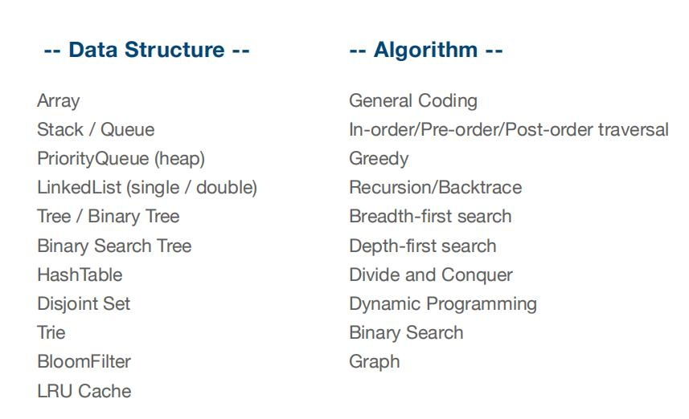

# 理论知识
- 算法与数据结构

<!-- 

 -->

<div style="width:800px">
    
    <div>
        
        
    </div>
</div>


- 时间复杂度


     时间复杂度中的log（n）底数到底是多少？


    假设有底数为2和3的两个对数函数，如上图。当X取N（数据规模）时，求所对应的时间复杂度得比值，即对数函数对应的y值，用来衡量对数底数对时间复杂度的影响。

    比值为log2 N / log3 N，运用换底公式后得：(lnN/ln2) / (lnN/ln3) = ln3 / ln2，ln为自然对数，显然这是个常数，与变量N无关。

    用文字表述：算法时间复杂度为log（n）时，不同底数对应的时间复杂度的倍数关系为常数，不会随着底数的不同而不同，因此可以将不同底数的对数函数所代表的时间复杂度，当作是同一类复杂度处理，即抽象成一类问题。
    
    ps:换底公式，log10=或loge X = lnX

- 数组与链表

    操作| Array | Linked List&Doubly Linked List |
    - | :-: | :-: | 
   Array | O(1) | O(N) | 
    int | O(N)| O(1)| 
    del |O(N)| O(1) | 

  

# leetcode题目练习
- 1. Two Sum
    ```
    Given an array of integers, return indices of the two numbers such that they add up to a specific target.

    You may assume that each input would have exactly one solution, and you may not use the same element twice.

    Example:

    Given nums = [2, 7, 11, 15], target = 9,

    Because nums[0] + nums[1] = 2 + 7 = 9,
    return [0, 1].
    ```

- 567. Permutation in String
    ```
    Given two strings s1 and s2, write a function to return true if s2 contains the permutation of s1. In other words, one of the first string's permutations is the substring of the second string.
    Example 1:

    Input: s1 = "ab" s2 = "eidbaooo"
    Output: True
    Explanation: s2 contains one permutation of s1 ("ba").
    Example 2:

    Input:s1= "ab" s2 = "eidboaoo"
    Output: False

    Note:

    The input strings only contain lower case letters.
    The length of both given strings is in range [1, 10,000].
    ```
